# FleetOps API

<div align="center">

[](https://learn.microsoft.com/dotnet/csharp/)
[](https://dotnet.microsoft.com/)
[](https://dotnet.microsoft.com/apps/aspnet)
[](https://www.postgresql.org/)
[](https://learn.microsoft.com/ef/core/)
[](https://www.rabbitmq.com/)
[](https://www.docker.com/)
[](https://opentelemetry.io/)
[](https://github.com/DevYuriVieira/fleetops-api/actions/workflows/ci.yml)
[](#23-testing)
[](#30-production-gate)

**Production-Grade Fleet & Logistics Backend Engine**  
*A distributed, event-driven fleet operations REST API built for transactional consistency, resilience, and asynchronous processing.*

[🇧🇷 Português](#-português) &nbsp;•&nbsp; [🇺🇸 English](#-english)

</div>

---

<a name="-português"></a>
# 🇧🇷 Português

## Resumo Executivo de Engenharia

| Área | Implementação no FleetOps |
|---|---|
| **Arquitetura** | Clean Architecture + Domain-Driven Design (DDD) com isolamento estrito |
| **Runtime & Framework** | .NET 10 (C# 14) / ASP.NET Core 10.0.11 |
| **Persistência de Dados** | PostgreSQL 18 (PostgreSQL 18 Alpine no Docker) |
| **Mapeamento Objeto-Relacional** | Entity Framework Core 10.0.11 + Npgsql.EntityFrameworkCore.PostgreSQL 10.0.3 |
| **Mensageria Assíncrona** | RabbitMQ 3.x com RabbitMQ.Client 7.2.2 (Async API) |
| **Confiabilidade de Eventos** | Transactional Outbox Pattern integrado ao `DbContext.SaveChangesAsync` |
| **Concorrência no Outbox** | `FOR UPDATE SKIP LOCKED` (Trabalhadores paralelos selecionam lotes distintos sem aguardar linhas bloqueadas) |
| **Rastreamento Distribuído** | OpenTelemetry .NET + Jaeger (Propagação W3C `traceparent` de ponta a ponta: HTTP &rarr; Outbox &rarr; RabbitMQ &rarr; Consumidor) |
| **Autenticação & Autorização** | JWT Bearer Tokens (HMAC-SHA256) + RBAC (`Admin`, `FleetManager`, `Dispatcher`, `Driver`) |
| **Semântica de Entrega** | Bounded At-least-once delivery (com retries finitos e Dead-Letter Queue) |
| **Idempotência de Consumo** | Efeito de negócio único dentro da fronteira transacional auditada (`MessageId` PK) |
| **Controle de Resiliência** | Dead-Letter Exchange (DLX), Filas TTL de Retry (10s, 30s, 90s) e Dead-Letter Queue (DLQ) |
| **Confirmação de Mensageria** | Publisher Confirms habilitado no Outbox Publisher e Consumer (confirmação formal do broker) |
| **Controle de Concorrência** | PostgreSQL Unique Constraints + Concorrência Otimista com `xmin` (`xid` system column) |
| **Tratamento de Falhas** | RFC 9457 `ProblemDetails` sanitizado com mascaramento total de credenciais e SQL |
| **Proteção de Runtime** | Rate Limiting em memória por instância (Fixed Window: 100 req/60s, QueueLimit 0) com RFC 9457 (HTTP 429) e `Retry-After` |
| **Métricas & Observabilidade** | System.Diagnostics.Metrics (`fleetops.http.*`, `fleetops.outbox.*`, `fleetops.consumer.*`) com disciplina de cardinalidade |
| **Testes Automatizados** | 289 testes automatizados (166 testes de unidade + 123 testes de integração e falhas) |
| **Containerização** | Dockerfile multi-stage com execução non-root (`$APP_UID`) + Docker Compose (API, Postgres, RabbitMQ, Jaeger) |
| **Contrato de API & Saúde** | OpenAPI 3.1 (`/openapi/v1.json`), Liveness (`/health/live`), Readiness (`/health/ready`), Dependências (`/health/dependencies`) |

---

## 1. Visão Geral (Overview)

O **FleetOps API** é um backend de gerenciamento de frotas e logística de alta confiabilidade projetado para operar em cenários reais com alta exigência de consistência transacional e tolerância a falhas distribuídas.

Diferente de aplicações CRUD tradicionais, o FleetOps foi construído para resolver problemas críticos do ciclo operacional logístico:
- **Gestão Integrada de Ativos:** Operação de veículos, motoristas, entregas, rotas e ordens de serviço mecânico mantendo fronteiras transacionais limpas.
- **Prevenção de Dual-Write Hazard:** Eliminação do risco de inconsistência entre gravação no banco de dados relacional e publicação de eventos no broker de mensageria.
- **Processamento Assíncrono Idempotente:** Garantia de que reentregas de mensagens decorrentes de falhas transitórias de rede ou reinicialização de instâncias não corrompam os registros contábeis e de auditoria da frota.
- **Concorrência Defensiva:** Blindagem contra condições de corrida (race conditions) tanto na camada de aplicação quanto no nível físico do PostgreSQL através de índices parciais exclusivos e controle otimista de versão de linha (`xmin`).

---

## 2. Capacidades do Domínio (Core Capabilities)

O modelo foi decomposto em 5 contextos delimitados (Bounded Contexts), representados por Aggregates independentes:

### Veículos (`Vehicle`)
- Cadastro com validação de formato de placa de trânsito (`LicensePlate`), ano, fabricante e capacidade de carga em quilogramas.
- Ativação e Desativação operacional, desvinculando automaticamente motoristas associados ao desativar.
- Associação exclusiva de condutor: o agregado `Vehicle` detém a chave estrangeira `CurrentDriverId`, emitindo eventos de desassociação do condutor anterior e associação do novo condutor.
- Atualização estritamente monotônica não-decrescente de odômetro (`Mileage`).
- Transições seguras para manutenção (`SendToMaintenance`) e retorno (`ReturnFromMaintenance`).

### Motoristas (`Driver`)
- Registro de credenciais de motorista com garantia de unicidade de Carteira Nacional de Habilitação (`LicenseNumber`).
- Validação de endereço de e-mail e formato de telefone.
- Ciclo de estados operacionais: `Active`, `Inactive` e `Suspended` (com exigência de motivo auditável).
- Total desacoplamento de veículos: `Driver` não referencia `Vehicle`.

### Entregas (`Delivery`)
- Emissão com código de rastreamento exclusivo (`TrackingCode`), endereços de origem/destino (`Address`), nível de prioridade e peso da carga.
- Atribuição a veículo e motorista simultaneamente com validação prévia de capacidade de carga.
- Transições de ciclo de vida: `Pending` &rarr; `Assigned` &rarr; `InTransit` &rarr; `Delivered` ou `Cancelled` (com justificativa).

### Rotas (`Route`)
- Planejamento com endereços de origem e destino e checagem cronológica de horários (`PlannedDeparture` anterior a `EstimatedArrival`).
- Atribuição de veículo e motorista designados.
- Associação e desassociação de entregas compatíveis (`delivery_ids uuid[]`).
- Início de percurso (`Start`) com exigência de veículo, condutor e pelo menos uma entrega vinculada.
- Conclusão com validação de horário real e cancelamento defensivo.

### Manutenção (`Maintenance`)
- Agendamento de ordens de serviço (`Preventive`, `Corrective`) com data programada.
- Início do serviço com timestamp de abertura.
- Finalização com apropriação de custos monetários (`Money` com precisão decimal e moeda) e retorno opcional do veículo para o status ativo.
- Cancelamento auditado com registro de justificativa.

---

## 3. Arquitetura do Sistema (System Architecture)

A arquitetura do FleetOps garante que a gravação do estado da aplicação e a produção de eventos ocorram sob a mesma transação ACID do PostgreSQL. O RabbitMQ opera como downstream assíncrono desacoplado, **sem jamais participar da transação original**.

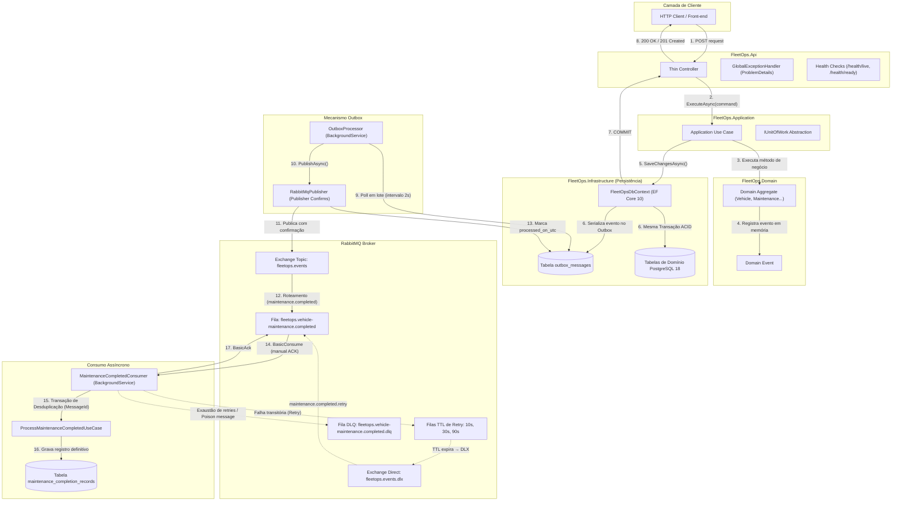

---

## 4. Arquitetura em Camadas (Clean Architecture)

O projeto segue à risca o princípio da inversão de dependência. O núcleo de negócio não depende de bibliotecas de terceiros, frameworks web ou provedores de dados.

```
       ┌──────────────────────────────┐
       │         FleetOps.Api         │
       └───────┬──────────────┬───────┘
               │              │
               │       ┌──────▼───────────────────────┐
               │       │   FleetOps.Infrastructure    │
               │       └──────────────┬───────────────┘
               │                      │
       ┌───────▼──────────────────────▼┐
       │     FleetOps.Application     │
       └──────────────┬───────────────┘
                      │
       ┌──────────────▼───────────────┐
       │       FleetOps.Domain        │  ◄── ZERO dependências externas
       └──────────────────────────────┘
```

### `FleetOps.Domain`
- Contém entidades, agregados (`AggregateRoot`), value objects, eventos de domínio (`IDomainEvent`), exceções específicas de regras de negócio e enums.
- **Zero referências externas**: utiliza unicamente bibliotecas base da runtime do .NET (`System`).
- Não conhece HTTP, banco de dados, ORM, serializadores ou brokers.

### `FleetOps.Application`
- Contém os 28 casos de uso mapeados para comandos fortemente tipados (`[Action][Entity]Command` e `[Action][Entity]UseCase`).
- Define as abstrações de persistência (`IVehicleRepository`, `IDriverRepository`, `IMaintenanceRepository`, `IDeliveryRepository`, `IRouteRepository`, `IMaintenanceCompletionRecordRepository`) e o boundary `IUnitOfWork`.
- Orquestra agregações sem misturar detalhes de infraestrutura.
- Não referencia `FleetOps.Infrastructure`, `FleetOps.Api`, Entity Framework Core ou RabbitMQ.

### `FleetOps.Infrastructure`
- Implementa a camada de dados via Entity Framework Core 10 e driver PostgreSQL (`Npgsql`).
- Gerencia o ciclo de vida transacional do Transactional Outbox dentro de `FleetOpsDbContext.SaveChangesAsync`.
- Implementa `RabbitMqConnection`, `RabbitMqPublisher`, serviços em segundo plano (`OutboxProcessor`, `MaintenanceCompletedConsumer`) e mapeamento defensivo de exceções (`DatabaseExceptionMapper`).

### `FleetOps.Api`
- Ponto de entrada HTTP do ASP.NET Core 10.
- Controladores finos (*thin controllers*): recebem DTOs de contrato, propagam `CancellationToken` e delegam imediatamente para o Use Case correspondente.
- Regra arquitetural validada por testes: nenhum controller acessa `DbContext`, `IUnitOfWork` ou repositórios diretamente.
- Middleware global de tratamento de exceções compatível com RFC 9457 `ProblemDetails`.

---

## 5. Modelo de Domínio (Domain Model)

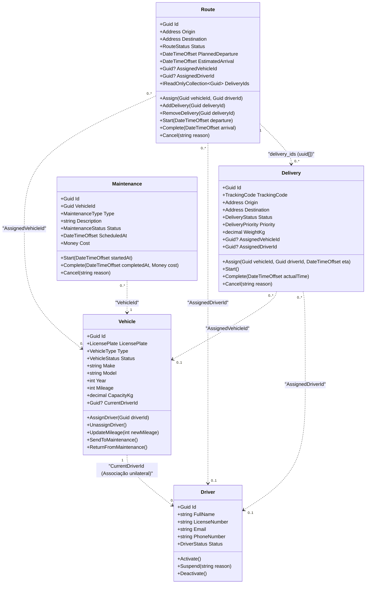

> [!IMPORTANT]
> **Fronteira Veículo & Motorista:**
> O agregado `Vehicle` é a autoridade exclusiva da associação com o motorista (`Vehicle.CurrentDriverId`). O agregado `Driver` não armazena referências para veículos, eliminando redundâncias e divergências de concorrência. Quando um novo motorista é designado para um veículo que já possuía condutor, o agregado emite primeiro `DriverUnassignedFromVehicleDomainEvent` para o condutor anterior e, em seguida, `DriverAssignedToVehicleDomainEvent` para o novo condutor.

---

## 6. Regras de Negócio e Consistência (Business Rules & Consistency)

A robustez do FleetOps apoia-se em uma estratégia de dupla camada de proteção:

```
Requisição do Usuário
       ↓
[ Camada de Aplicação / Domínio ] ── Checagens lógicas prévias e transições de estado
       ↓
[ Banco de Dados PostgreSQL ]     ── Barreira física definitiva contra condições de corrida
```

### Invariantes do Domínio
1. **Unicidade de Associação:** Apenas um condutor pode estar associado a um veículo por vez. Veículos inativos ou sob manutenção não podem receber condutores.
2. **Atualização Monotônica de Odômetro:** A quilometragem informada em `Vehicle.UpdateMileage` não pode ser inferior ao odômetro atual.
3. **Não-duplicação de Manutenção Ativa:** Um veículo não pode ter mais de uma manutenção em andamento (`Scheduled` ou `InProgress`).
4. **Proteção de Retorno de Manutenção:** O caso de uso `ReturnVehicleFromMaintenance` impede o retorno operacional do veículo se ainda constar registro ativo de manutenção no repositório.
5. **Elegibilidade de Cargas em Rotas:** Entregas só podem ser acopladas a uma rota em estado `Planned` se estiverem com status `Pending` ou `Assigned`.
6. **Massa e Capacidade:** A vinculação de entrega verifica se a capacidade do veículo suporta o peso da carga (`Delivery.WeightKg <= Vehicle.CapacityKg`).
7. **Consistência Cronológica de Rotas:** O horário estimado de chegada deve ser posterior à partida planejada; a conclusão efetiva não pode preceder a saída real.

---

## 7. Persistência de Dados e PostgreSQL 18

A infraestrutura utiliza o PostgreSQL 18 e o EF Core 10 com convenções de mapeamento estritas:

### Restrições Físicas e Índices Definidos

```sql
-- Garante no máximo UMA manutenção ativa (Scheduled ou InProgress) por veículo no banco de dados
CREATE UNIQUE INDEX ix_maintenances_vehicle_id 
ON maintenances (vehicle_id) 
WHERE status IN ('Scheduled', 'InProgress');

-- Unicidade de placa veicular
CREATE UNIQUE INDEX uq_vehicles_license_plate ON vehicles (license_plate);

-- Unicidade de CNH do motorista
CREATE UNIQUE INDEX uq_drivers_license_number ON drivers (license_number);

-- Unicidade do código de rastreamento de entregas
CREATE UNIQUE INDEX uq_deliveries_tracking_code ON deliveries (tracking_code);

-- Otimização do polling de mensagens pendentes do Outbox
CREATE INDEX ix_outbox_messages_unprocessed 
ON outbox_messages (occurred_on_utc) 
WHERE processed_on_utc IS NULL;
```

### Detalhes Técnicos do Esquema
- **Integridade Referencial:** Todas as Foreign Keys são configuradas com `DeleteBehavior.Restrict`, impedindo deleções em cascata acidentais de entidades auditáveis.
- **Tipagem Monetária Precisa:** Custos de manutenção são persistidos em colunas separadas `cost_amount numeric(12,2)` e `cost_currency character varying(3)`.
- **Coleção de UUIDs Nativa:** A relação entre `Route` e suas entregas armazena os identificadores diretamente no tipo nativo PostgreSQL `uuid[]` com suporte a `ValueComparer`.
- **Timestamps com Fuso Horário:** Todas as datas são gravadas como `timestamp with time zone` (`DateTimeOffset`), eliminando ambiguidades de horário local.
- **Mapeamento de Enums:** Enums de status e categoria são persistidos como `varchar`, preservando a legibilidade e manutenibilidade dos dados independentemente da ordenação ordinal do código.

---

## 8. Controle de Concorrência (Concurrency Control)

O FleetOps emprega estratégias complementares contra conflitos concorrentes:

### 1. Índices Parciais Únicos (Prevenção Estrutural)
Se duas requisições simultâneas tentarem agendar uma manutenção para o mesmo veículo ao mesmo tempo, ambas podem passar pela validação em memória do Use Case. No entanto, ao executar o `INSERT`, o PostgreSQL aplica a restrição do índice `ix_maintenances_vehicle_id`. Apenas uma transação obtém sucesso; a transação perdedora é abortada com o código `23505 (unique_violation)`.

### 2. Concorrência Otimista com PostgreSQL `xmin`
Todas as entidades principais (`Vehicle`, `Driver`, `Delivery`, `Route`, `Maintenance`) utilizam a coluna oculta de sistema do PostgreSQL `xmin` mapeada como token de concorrência (`IsRowVersion()`):

```csharp
builder.Property<uint>("Version").IsRowVersion();
```

No banco, essa propriedade mapeia para a coluna de sistema `xmin xid`:
```sql
xmin table.Column<uint>(type: "xid", rowVersion: true, nullable: false)
```

**Mecanismo de Proteção:**
1. A transação `A` e a transação `B` lêem o veículo na versão `X`.
2. A transação `A` atualiza a quilometragem e comita. O PostgreSQL atualiza o `xmin` do registro para `X+1`.
3. A transação `B` tenta atualizar o condutor gerando um comando `UPDATE vehicles ... WHERE id = @id AND xmin = @originalXmin`.
4. Nenhuma linha é afetada. O EF Core intercepta e dispara `DbUpdateConcurrencyException`.
5. O `DatabaseExceptionMapper` traduz a exceção para um `ConflictException` (HTTP 409), impedindo *lost updates* silenciosos.

---

## 9. Transactional Outbox

O padrão Transactional Outbox resolve o problema clássico de *dual-write hazard* em sistemas distribuídos:

```
❌ ABORDAGEM FALHA (DUAL-WRITE HAZARD):
1. DbContext.SaveChangesAsync()  ──> Banco comitado
2. RabbitMq.Publish()            ──> Falha de rede ou crash da aplicação!
Resultado: Dados gravados no banco, mas evento perdido para sempre.
```

```
✅ TRANSAÇÃO ATÔMICA COM OUTBOX:
1. AggregateRoot registra evento de domínio internamente.
2. DbContext.SaveChangesAsync() intercepta os eventos no ChangeTracker.
3. Serializa o evento como registro na tabela 'outbox_messages'.
4. Comita o estado do agregado E a mensagem na MESMA transação ACID do PostgreSQL.
5. Em caso de falha no banco, ambos são revertidos e os eventos em memória são preservados.
6. O OutboxProcessor em segundo plano lê as mensagens e publica no RabbitMQ.
```

### O Ciclo no `FleetOpsDbContext`
```csharp
public override async Task<int> SaveChangesAsync(CancellationToken cancellationToken = default)
{
    var aggregatesWithEvents = ChangeTracker.Entries<AggregateRoot>()
        .Where(e => e.Entity.DomainEvents.Count > 0)
        .Select(e => e.Entity)
        .ToList();

    if (aggregatesWithEvents.Count > 0)
    {
        var outboxMessages = aggregatesWithEvents
            .SelectMany(a => a.DomainEvents)
            .Select(OutboxMessage.FromDomainEvent)
            .ToList();

        await OutboxMessages.AddRangeAsync(outboxMessages, cancellationToken);
    }

    var result = await base.SaveChangesAsync(cancellationToken);

    // Eventos são limpos da memória SOMENTE se o commit da transação tiver êxito
    foreach (var aggregate in aggregatesWithEvents)
    {
        aggregate.ClearDomainEvents();
    }

    return result;
}
```

### Concorrência Multi-Réplica com `FOR UPDATE SKIP LOCKED`

Em arquiteturas cloud escaláveis com múltiplos pods da API em execução paralela (Kubernetes HPA ou instâncias de microsserviços), múltiplos processos `OutboxProcessor` realizam polling concorrente na tabela `outbox_messages`. Sem controle defensivo de concorrência a nível de linha, múltiplas instâncias leriam as mesmas mensagens simultaneamente, provocando **publicações duplicadas no broker RabbitMQ**, contenção de locks e potenciais deadlocks nas tentativas de atualização.

O FleetOps resolve essa concorrência através do bloqueio pessimista a nível de linha com **`FOR UPDATE SKIP LOCKED`**, executado sob transação ACID via EF Core `ExecutionStrategy`:

```sql
SELECT * FROM outbox_messages
WHERE processed_on_utc IS NULL AND attempts < @maxAttempts
ORDER BY occurred_on_utc
LIMIT @batchSize
FOR UPDATE SKIP LOCKED;
```

```csharp
var strategy = _context.Database.CreateExecutionStrategy();

return await strategy.ExecuteAsync(async () =>
{
    await using var transaction = await _context.Database.BeginTransactionAsync(cancellationToken);

    var messages = await _context.OutboxMessages
        .FromSqlRaw(
            """
            SELECT * FROM outbox_messages
            WHERE processed_on_utc IS NULL AND attempts < {0}
            ORDER BY occurred_on_utc
            LIMIT {1}
            FOR UPDATE SKIP LOCKED
            """,
            _options.MaxAttempts,
            _options.BatchSize)
        .ToListAsync(cancellationToken);

    // Processa, despacha e publica no RabbitMQ com trace context...
    await _context.SaveChangesAsync(cancellationToken);
    await transaction.CommitAsync(cancellationToken);

    return processedCount;
});
```

**Benefícios Arquiteturais Comprovados:**
1. **Particionamento Dinâmico de Carga:** Se a Réplica 1 seleciona as mensagens 1 a 20, o PostgreSQL bloqueia essas linhas. Quando a Réplica 2 executa a query simultaneamente, o `SKIP LOCKED` faz com que o banco **ignore imediatamente as linhas bloqueadas sem esperar**, selecionando as mensagens 21 a 40.
2. **Ausência de Espera por Lock na Seleção:** Nenhuma réplica fica enfileirada aguardando liberação de lock de linhas já selecionadas por outra instância; o banco ignora linhas travadas imediatamente, eliminando contenção de polling concorrente sob a carga testada.
3. **Isolamento de Falha:** Se uma réplica sofrer um crash abrupto enquanto processa seu lote, a transação correspondente é abortada e o PostgreSQL libera os locks automaticamente, permitindo que a próxima réplica ativa processe as mensagens restantes.

---

## 10. Mensageria com RabbitMQ (Messaging Architecture)

A topologia de mensageria foi projetada para garantir resiliência operacional nativa:

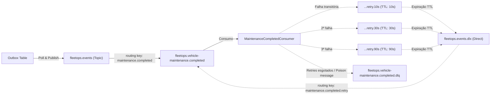

### Detalhamento da Topologia
- **Exchange Principal:** `fleetops.events` (Tipo `Topic`, durável).
- **Fila de Consumo Primária:** `fleetops.vehicle-maintenance.completed` (durável, configurada com `x-dead-letter-exchange: fleetops.events.dlx`).
- **Exchange de Falhas (DLX):** `fleetops.events.dlx` (Tipo `Direct`, durável).
- **Dead-Letter Queue (DLQ):** `fleetops.vehicle-maintenance.completed.dlq` (durável).
- **Filas de Reprocessamento Escalonado (Native TTL):**
  - `fleetops.vehicle-maintenance.completed.retry.10s` (TTL: 10.000 ms)
  - `fleetops.vehicle-maintenance.completed.retry.30s` (TTL: 30.000 ms)
  - `fleetops.vehicle-maintenance.completed.retry.90s` (TTL: 90.000 ms)

---

## 11. Evento de Negócio: `MaintenanceCompleted`

Quando uma manutenção preventiva ou corretiva é concluída, um evento é gerado e processado pelo ecossistema:

1. **Origem:** Chamada ao método `Maintenance.Complete(completedAt, cost)`.
2. **Emissão:** Registro de `MaintenanceCompletedDomainEvent(Id, VehicleId, Cost, CompletedAt, OccurredOn)`.
3. **Persistência:** Gravado na tabela `outbox_messages` com o tipo de evento `MaintenanceCompleted`.
4. **Publicação:** `OutboxProcessor` publica a mensagem na exchange `fleetops.events` sob o routing key `maintenance.completed` utilizando Publisher Confirms.
5. **Consumo:** O `MaintenanceCompletedConsumer` recebe a mensagem.
6. **Efeito de Negócio:** Executa `ProcessMaintenanceCompletedUseCase`, persistindo de forma durável um registro na tabela `maintenance_completion_records`:
   - `message_id`: Identificador original da mensagem do Outbox.
   - `maintenance_id`: Identificador da ordem de manutenção.
   - `vehicle_id`: Identificador do veículo associado.
   - `completed_on_utc`: Timestamp informado no momento do fechamento mecânico.
   - `processed_on_utc`: Timestamp de execução do consumidor.

---

## 12. Semântica de Entrega e Confiabilidade (Delivery Semantics)

O FleetOps opera sob a semântica **At-Least-Once Delivery**. 

Em sistemas distribuídos reais sobre redes TCP, o compromisso de "exactly-once delivery" é uma ilusão teórica perigosa. Podem ocorrer falhas de hardware ou rede logo após a gravação no banco de dados e antes do envio do ACK ao RabbitMQ:

```
[ Mensagem recebida ]
       ↓
[ Gravação no PostgreSQL bem-sucedida ]
       ↓
   CRASH OU FALHA DE REDE ANTES DO ACK!
       ↓
[ RabbitMQ identifica queda da conexão e reentrega a mensagem ]
```

Para garantir que a reentrega da mensagem não produza efeitos colaterais duplicados, o consumidor deve ser estritamente idempotente.

---

## 13. Consumidor Idempotente (Idempotent Consumer)

A idempotência no consumidor `MaintenanceCompletedConsumer` é implementada utilizando a chave primária `MessageId`:

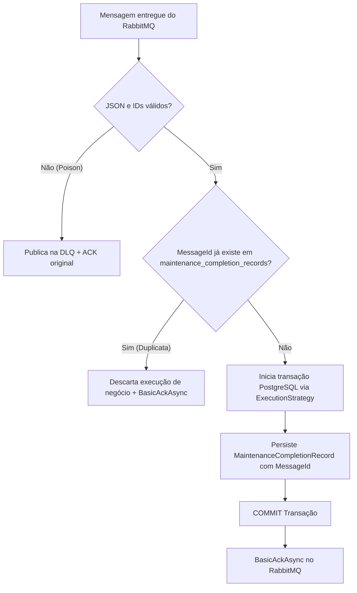

Se a mensagem for reentregue pelo broker devido a um reinício do container, a consulta pelo `MessageId` detecta o processamento anterior e emite o ACK imediatamente sem gerar duplicidade.

---

## 14. Mecanismo de Retry e Dead Letter Queue (DLQ)

O mecanismo evita o erro comum de realizar `BasicNack(requeue: true)` em loop contínuo, o qual satura a CPU e trava a fila:

1. **Detecção de Falha Transitória:** Caso o banco esteja temporariamente indisponível durante o consumo, a falha é capturada.
2. **Incremento de Cabeçalho:** O consumidor insere ou incrementa o header AMQP `x-retry-count`.
3. **Encaminhamento para Fila TTL:**
   - Tentativa 1 &rarr; Fila `.retry.10s` (aguarda 10 segundos).
   - Tentativa 2 &rarr; Fila `.retry.30s` (aguarda 30 segundos).
   - Tentativa 3 &rarr; Fila `.retry.90s` (aguarda 90 segundos).
4. **Redirecionamento Automático:** Ao expirar o TTL de cada fila, o RabbitMQ direciona a mensagem para a `fleetops.events.dlx`, que a devolve à fila principal `fleetops.vehicle-maintenance.completed`.
5. **Exaustão ou Mensagem Venenosa (Poison Message):** Após esgotar 3 tentativas ou se a mensagem possuir payload JSON corrompido, ela é enviada à fila de descarte final `fleetops.vehicle-maintenance.completed.dlq` com cabeçalhos de diagnóstico `x-dlq-reason` e `x-exception-message`.

---

## 15. Confirmações de Publicação (Publisher Confirms)

Para evitar perda de mensagens em trânsito, o sistema habilita confirmações explícitas do broker tanto na ponta do publicador quanto no consumidor:

```csharp
var channelOptions = new CreateChannelOptions(
    publisherConfirmationsEnabled: true,
    publisherConfirmationTrackingEnabled: true);
```

### Regra de Ordenação do Consumidor
Ao despachar uma mensagem com falha para a fila de retry ou para a DLQ, o consumidor **aguarda a confirmação de recebimento do RabbitMQ antes de emitir o ACK da mensagem original**. Se o broker falhar ao receber a mensagem de retry, o ACK não é emitido, evitando perda involuntária de dados.

---

## 16. Matriz de Cenários de Falha (Failure Scenarios)

| Cenário de Falha | Comportamento Esperado do Sistema | Garantia Observada |
|---|---|---|
| **PostgreSQL indisponível na API** | Requisição falha de forma segura; `/health/ready` retorna HTTP 503; zero vazamento de connection string. | Fail-fast sem corrupção |
| **RabbitMQ indisponível durante criação** | A transação de negócio e a gravação do Outbox comitam normalmente no PostgreSQL. | Zero impacto no usuário final |
| **Falha na publicação do Outbox** | O `OutboxProcessor` grava a mensagem de erro e o incremento de tentativas na linha do Outbox, reprocessando no ciclo seguinte. | At-least-once outbox delivery |
| **Falha no banco durante o consumo** | Mensagem roteada para fila TTL de retry (10s &rarr; 30s &rarr; 90s) preservando integridade. | Resiliência a falhas transitórias |
| **Entrega duplicada de mensagem** | O consumidor detecta o `MessageId` previamente registrado e emite ACK sem reexecutar efeitos de negócio. | Idempotência garantida |
| **Mensagem com JSON corrompido (Poison)** | Detectada no deserializador e roteada imediatamente para a DLQ com motivo documentado; fila principal desimpedida. | Proteção contra travamento de fila |
| **Queda do servidor pós-commit do consumidor** | Ao reiniciar, o broker reentrega a mensagem; a verificação por `MessageId` impede duplicação e emite o ACK pendente. | Consistência pós-falha |
| **Atualização concorrente de mesmo veículo** | O PostgreSQL acusa incompatibilidade no `xmin`; o EF Core dispara concorrência e a API retorna HTTP 409 ProblemDetails. | Prevenção de *lost updates* |
| **Cadastro duplicado de placa/CNH** | Restrição de unicidade física (`uq_...`) barra a operação no banco e a API responde HTTP 409 ProblemDetails sanitizado. | Integridade relacional estrita |

---

## 17. Inventário de Endpoints REST (REST API)

Todos os 28 endpoints de negócio utilizam verbos semânticos e contratos estritos:

### Autenticação (`/api/auth`) — `[AllowAnonymous]`
| Método | Rota | Objetivo | Sucesso |
|:---:|:---|:---|:---:|
| `POST` | `/api/auth/token` | Gerar token JWT assinado para autenticação e testes RBAC | `200 OK` |

### Veículos (`/api/vehicles`) — Roles: `Admin`, `FleetManager`
| Método | Rota | Objetivo | Sucesso |
|:---:|:---|:---|:---:|
| `POST` | `/api/vehicles` | Cadastrar novo veículo na frota | `201 Created` |
| `POST` | `/api/vehicles/{id}/activate` | Ativar veículo inativo | `200 OK` |
| `POST` | `/api/vehicles/{id}/deactivate` | Desativar veículo ativo (desvincula condutor) | `200 OK` |
| `POST` | `/api/vehicles/{id}/assign-driver` | Designar condutor para o veículo | `200 OK` |
| `POST` | `/api/vehicles/{id}/unassign-driver` | Remover condutor do veículo | `200 OK` |
| `POST` | `/api/vehicles/{id}/mileage` | Atualizar odômetro (estritamente não-decrescente) | `200 OK` |
| `POST` | `/api/vehicles/{id}/send-to-maintenance` | Enviar veículo para manutenção | `200 OK` |
| `POST` | `/api/vehicles/{id}/return-from-maintenance` | Retornar veículo da manutenção para ativo | `200 OK` |

### Motoristas (`/api/drivers`) — Roles: `Admin`, `FleetManager`
| Método | Rota | Objetivo | Sucesso |
|:---:|:---|:---|:---:|
| `POST` | `/api/drivers` | Registrar novo motorista (CNH única) | `201 Created` |
| `POST` | `/api/drivers/{id}/activate` | Ativar motorista | `200 OK` |
| `POST` | `/api/drivers/{id}/deactivate` | Desativar motorista | `200 OK` |
| `POST` | `/api/drivers/{id}/suspend` | Suspender motorista com justificativa | `200 OK` |

### Entregas (`/api/deliveries`) — Roles: `Admin`, `FleetManager`, `Dispatcher`
| Método | Rota | Objetivo | Sucesso |
|:---:|:---|:---|:---:|
| `POST` | `/api/deliveries` | Criar nova ordem de entrega com código de rastreio | `201 Created` |
| `POST` | `/api/deliveries/{id}/assign` | Vincular veículo e motorista à entrega | `200 OK` |
| `POST` | `/api/deliveries/{id}/start` | Iniciar transporte da entrega | `200 OK` |
| `POST` | `/api/deliveries/{id}/complete` | Registrar conclusão e entrega ao destinatário | `200 OK` |
| `POST` | `/api/deliveries/{id}/cancel` | Cancelar entrega com justificativa | `200 OK` |

### Rotas (`/api/routes`) — Roles: `Admin`, `FleetManager`, `Dispatcher`
| Método | Rota | Objetivo | Sucesso |
|:---:|:---|:---|:---:|
| `POST` | `/api/routes` | Criar itinerário de rota | `201 Created` |
| `POST` | `/api/routes/{id}/assign` | Designar veículo e motorista para a rota | `200 OK` |
| `POST` | `/api/routes/{id}/deliveries` | Incluir entrega compatível na rota | `200 OK` |
| `DELETE` | `/api/routes/{id}/deliveries/{deliveryId}` | Remover entrega da rota | `200 OK` |
| `POST` | `/api/routes/{id}/start` | Iniciar trajeto da rota | `200 OK` |
| `POST` | `/api/routes/{id}/complete` | Concluir trajeto da rota | `200 OK` |
| `POST` | `/api/routes/{id}/cancel` | Cancelar rota planejada ou em trânsito | `200 OK` |

### Manutenção (`/api/maintenances`) — Roles: `Admin`, `FleetManager`
| Método | Rota | Objetivo | Sucesso |
|:---:|:---|:---|:---:|
| `POST` | `/api/maintenances` | Agendar manutenção para veículo | `201 Created` |
| `POST` | `/api/maintenances/{id}/start` | Iniciar serviço mecânico | `200 OK` |
| `POST` | `/api/maintenances/{id}/complete` | Finalizar manutenção com registro de custos | `200 OK` |
| `POST` | `/api/maintenances/{id}/cancel` | Cancelar ordem de manutenção | `200 OK` |

### Observabilidade e Especificação — `[AllowAnonymous]`
| Método | Rota | Objetivo | Sucesso |
|:---:|:---|:---|:---:|
| `GET` | `/health/live` | Liveness Probe (processo do ASP.NET Core ativo) | `200 OK` |
| `GET` | `/health/ready` | Readiness Probe (validação de conexão ativa com PostgreSQL) | `200 OK` / `503` |
| `GET` | `/openapi/v1.json` | Documento de especificação OpenAPI 3.1 da API | `200 OK` |

---

## 18. Tratamento de Erros e ProblemDetails (RFC 9457)

Erros e exceções gerados na aplicação são interceptados centralizadamente pelo `GlobalExceptionHandler`:

| Tipo de Exceção | HTTP Status | Título ProblemDetails | Comportamento e Detalhes |
|---|:---:|---|---|
| `NotFoundException` | `404 Not Found` | "Not Found" | Entidade não localizada com o ID informado |
| `ConflictException` | `409 Conflict` | "Conflict" | Conflito de regra de negócio, unicidade ou concorrência |
| `DomainException` | `409 Conflict` | "Conflict" | Violação de transição de estado no agregado |
| `DomainValidationException` | `400 Bad Request` | "Bad Request" | Dados inválidos para construção ou mutação da entidade |
| `ValidationException` | `400 Bad Request` | "Bad Request" | Validação de entrada na camada de aplicação |
| `ArgumentException` | `400 Bad Request` | "Bad Request" | Argumento ausente ou formato incompatível |
| `BadHttpRequestException` / `JsonException` | `400 Bad Request` | "Bad Request" | Payload JSON malformado na requisição HTTP |
| Exceções Não Tratadas | `500 Internal Server Error` | "Internal Server Error" | Mensagem genérica sanitizada com rastreio via `traceId` |

> [!SECURITY]
> Respostas de erro 500 **jamais** vazam nomes de tabelas, consultas SQL, versões do driver Npgsql, stack traces ou dados de credenciais da string de conexão. O detalhamento completo permanece gravado exclusivamente nos logs internos do servidor associado ao identificador `traceId`.

---

## 19. Autenticação e Controle de Acesso Baseado em Papéis (JWT & RBAC)

A API protege seus recursos através de autenticação **JWT Bearer** (RFC 7519) com assinatura criptográfica HMAC-SHA256 e controle granular de autorização baseado em papéis (**RBAC - Role-Based Access Control**):

### Matriz de Papéis e Permissões

| Papel (Role) | Escopo de Atuação | Endpoints Autorizados |
|---|---|---|
| `Admin` | Gestão irrestrita de infraestrutura e negócios | Acesso total a todos os recursos da API |
| `FleetManager` | Gestão operacional de frota e ativos | `/api/vehicles/*`, `/api/drivers/*`, `/api/maintenances/*`, `/api/deliveries/*`, `/api/routes/*` |
| `Dispatcher` | Gestão logística de tráfego e despachos | `/api/deliveries/*`, `/api/routes/*` |
| `Driver` | Acesso operacional de condutor | Reservado no modelo RBAC para futuras consultas operacionais de condutores |

### Fluxo de Autenticação e Emissão de Token

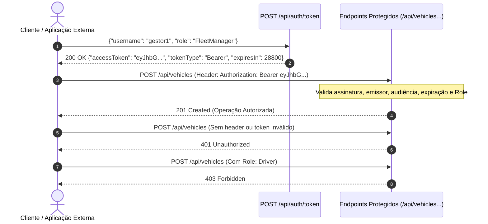

---

## 20. Rastreamento Distribuído Ponta a Ponta (OpenTelemetry & Jaeger)

Em sistemas orientados a eventos com processamento assíncrono desacoplado, entender a causalidade de uma operação que atravessa HTTP, banco de dados, filas e consumidores em segundo plano é um dos maiores desafios de observabilidade.

O FleetOps implementa rastreamento distribuído completo seguindo a especificação **W3C Trace Context** (`traceparent`), correlacionando cada requisição HTTP original ao seu ciclo assíncrono downstream no RabbitMQ e no consumidor:

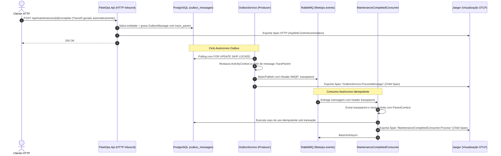

### Visualização no Jaeger UI
Todos os spans são exportados via protocolo OTLP gRPC (`port 4317`) diretamente para o serviço Jaeger all-in-one provisionado no `compose.yaml`:
- **Interface Web do Jaeger:** `http://localhost:16686`
- **Linha do Tempo Causal:** Permite inspecionar a latência exata de ponta a ponta, identificando quanto tempo o evento permaneceu na tabela Outbox até a publicação e quanto tempo transcorreu até o processamento definitivo no consumidor.

---

## 21. Observabilidade e Health Checks

A API provê probes compatíveis com orquestradores de containers:
- **Liveness (`/health/live`):** Avaliação ultra-leve sem I/O externo. Responde `200 OK` confirmando que a thread de execução do processo está ativa.
- **Readiness (`/health/ready`):** Avalia a conectividade real com o banco de dados executando `_dbContext.Database.CanConnectAsync()`. Retorna `200 OK` quando o banco aceita conexões ou `503 Service Unavailable` em caso de indisponibilidade.

---

## 22. Estrutura do Repositório (Project Structure)

```text
fleetops/
├── compose.yaml                      # Orquestração local (API, PostgreSQL, RabbitMQ, Jaeger)
├── Dockerfile                        # Multi-stage build .NET 10 (non-root $APP_UID)
├── .dockerignore                     # Filtros de exclusão de artefatos de compilação
├── .editorconfig                     # Padrões de formatação e análise estática de código
├── .env.example                      # Variáveis de ambiente padrão para desenvolvimento local
├── Directory.Build.props             # net10.0, Nullable, TreatWarningsAsErrors=true
├── Directory.Packages.props          # Central Package Management (CPM)
├── FleetOps.sln                      # Solução unificada
├── README.md                         # Documentação técnica integral
├── src/
│   ├── FleetOps.Domain/              # Núcleo DDD: Aggregates, ValueObjects, Events (zero dependências)
│   ├── FleetOps.Application/         # Casos de uso (28 comandos), DTOs, interfaces de persistência
│   ├── FleetOps.Infrastructure/      # EF Core 10, PostgreSQL, RabbitMQ Publisher & Consumer, Outbox, Diagnostics
│   └── FleetOps.Api/                 # Controllers, Auth, ProblemDetails, OpenAPI 3.1, Health Probes, OTel
└── tests/
    ├── FleetOps.UnitTests/           # 166 testes de unidade (Domínio, Aplicação, Arquitetura)
    └── FleetOps.IntegrationTests/    # 117 testes de integração (Postgres, RabbitMQ, Concorrência Outbox, Auth API, Tracing W3C, Resiliência e Injeção de Falhas)
```

---

## 23. Estratégia de Testes Automatizados (Testing)

O FleetOps possui **289 testes automatizados** com 100% de aprovação, garantindo a solidez do sistema em todas as camadas:

```text
Resultados da Execução:
  FleetOps.UnitTests.dll:        166 Aprovados (0 Falhas, 0 Ignorados)
  FleetOps.IntegrationTests.dll: 123 Aprovados (0 Falhas, 0 Ignorados)
  Total:                         289 Aprovados em 100% da suíte
```

### Categorias Cobertas
- **Testes de Arquitetura:** Verificação reflexiva estrita garantindo que `Domain` e `Application` não referenciem bibliotecas proibidas (`AspNetCore`, `EntityFrameworkCore`, `Npgsql`, `RabbitMQ`, `StackExchange.Redis`, `MediatR`). Garante também que todos os métodos de controllers e casos de uso aceitem `CancellationToken` e retornem `Task`.
- **Testes de Autenticação e RBAC (`AuthApiTests`):** Validação de emissão de tokens JWT, rejeição de credenciais inválidas, validação criptográfica real via `JwtBearerHandler` (tokens expirados, chave incorreta, emissor/audiência inválidos, tampering de payload), resposta HTTP 401 Unauthorized para acessos sem token e HTTP 403 Forbidden para papéis insuficientes (ex: `Driver` tentando cadastrar veículos).
- **Testes de Rastreamento Distribuído (`TracingPropagationTests`):** Validação automatizada em runtime via `ActivityListener` da propagação de contexto W3C (`TraceId`, `SpanId`, `ParentSpanId`, `traceparent`) de ponta a ponta: `DbContext` &rarr; `OutboxService` &rarr; RabbitMQ &rarr; Consumidor.
- **Testes de Concorrência de Outbox (`OutboxConcurrencyTests`):** Validação de que múltiplos workers executando concorrentemente sob `FOR UPDATE SKIP LOCKED` processam lotes disjuntos de mensagens sem sobreposição, sem lock contention e sem duplicação de eventos.
- **Testes de Engenharia de Resiliência e Falhas (`FailureInjectionTests`):** Validação empírica de fronteiras de falha com PostgreSQL e RabbitMQ reais: (1) publicação RabbitMQ bem-sucedida com falha simulada na marcação de banco e reentrega tratada de forma idempotente pelo consumidor; (2) crash abrupto do consumidor pós-commit e pré-ACK com reentrega via broker (`Redelivered == true`) mantendo efeito de negócio estritamente único; (3) rollback de transação relacional por violação de integridade física assegurando retenção de eventos de domínio em memória e zero mensagens no Outbox.
- **Testes de Rate Limiting (`RateLimitingTests`):** Validação da barreira local por instância Fixed Window (100 req/60s, QueueLimit 0), rejeição de requisições excedentes com HTTP 429 Too Many Requests, inclusão do cabeçalho `Retry-After` e payload padronizado RFC 9457 `ProblemDetails`.
- **Testes de Métricas Operacionais (`MetricsVerificationTests`):** Validação em tempo de execução via `System.Diagnostics.Metrics.MeterListener` da emissão de instrumentos do medidor `FleetOps` (`fleetops.outbox.messages.published`, `fleetops.consumer.messages.processed` e histogramas de latência) com aderência estrita à disciplina de cardinalidade.
- **Testes de Degradação Graciosa (`GracefulDegradationTests`):** Validação com broker RabbitMQ desativado/parado demonstrando desacoplamento transacional: `/health/ready` responde 200 OK (PostgreSQL saudável), `/health/dependencies` reporta `Degraded` com detalhe por componente, endpoints de escrita persistem transações no PostgreSQL e acumulam mensagens com segurança no Outbox.
- **Testes de Integração de Persistência:** Executados contra instância real do PostgreSQL, validando migrations, restrições exclusivas, tipos customizados e foreign keys.
- **Testes de Concorrência Otimista:** Verificação de conflito `xmin` com duas conexões paralelas tentando alterar o mesmo registro.
- **Testes de Concorrência de Manutenção:** Validação de que o índice parcial `ix_maintenances_vehicle_id` rejeita transações concorrentes criando manutenções simultâneas para o mesmo veículo.
- **Testes de Transactional Outbox:** Confirmação de que falhas na transação do banco preservam os eventos de domínio em memória e abortam a gravação no Outbox sem geração de lixo.
- **Testes Integrados de RabbitMQ:**
  - Publicação com Publisher Confirms.
  - Consumo com gravação idempotente de `MaintenanceCompletionRecord`.
  - Descarte seguro e envio para DLQ de mensagens corrompidas (Poison Messages).
  - Escalonamento de retry através das filas com TTL (10s, 30s, 90s).
  - Reentrega de mensagens após crash pós-commit sem duplicação de dados.
  - Shutdown limpo com encerramento ordeiro de canais AMQP.
- **Testes de Infraestrutura Docker:** Validação estática das diretivas de build do `Dockerfile` e do arquivo `compose.yaml`.

---

## 24. Ambiente Containerizado (Docker & Compose)

O arquivo `compose.yaml` provisiona a infraestrutura completa:

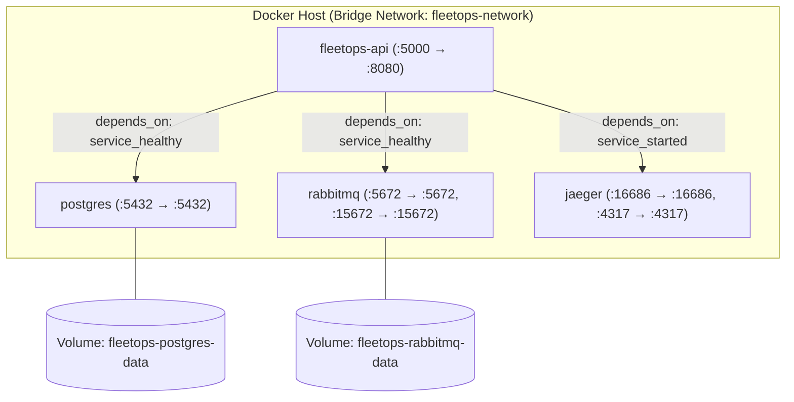

### Destaques de Engenharia de Containers
- **Multi-Stage Build:** Separa o estágio de compilação SDK (`dotnet/sdk:10.0`) da imagem de runtime final (`dotnet/aspnet:10.0`), reduzindo a superfície de ataque e tamanho da imagem.
- **Usuário Não-Privilegiado:** Executa no container sob o usuário nativo `$APP_UID` (não-root).
- **Ordenação de Inicialização:** A API declara `depends_on: service_healthy` para o PostgreSQL e RabbitMQ, e `service_started` para o Jaeger, impedindo falhas de inicialização prematuras.
- **Healthchecks Nativos:**
  - PostgreSQL avaliado via `pg_isready -U fleetops_dev -d fleetops`.
  - RabbitMQ avaliado via `rabbitmq-diagnostics -q ping`.
  - API avaliada via `curl -f http://localhost:8080/health/ready`.

---

## 25. Pilha Tecnológica (Technology Stack)

| Componente | Versão Real no Projeto | Propósito no Ecossistema |
|---|---|---|
| **Linguagem C#** | C# 14 | Sintaxe moderna, tipagem estrita e imutabilidade com `record` |
| **Plataforma .NET** | .NET 10.0 | Runtime de execução de alto desempenho |
| **Framework HTTP** | ASP.NET Core 10.0.11 | Roteamento REST, DI e pipeline de middlewares |
| **Autenticação & RBAC** | JwtBearer 10.0.11 | Assinatura HMAC-SHA256 e autorização declarativa por papéis |
| **Banco de Dados** | PostgreSQL 18-alpine | Armazenamento relacional ACID, índices parciais e `xmin` |
| **Provedor ORM** | EF Core 10.0.11 / Npgsql 10.0.3 | Mapeamento relacional e controle transacional |
| **Broker de Mensagens** | RabbitMQ 3-management-alpine | Fila de mensageria assíncrona, trocas e DLQ |
| **Cliente RabbitMQ** | RabbitMQ.Client 7.2.2 | Comunicação assíncrona nativa com Publisher Confirms |
| **Rastreamento Distribuído** | OpenTelemetry 1.15.3 | Instrumentação e exportação de traces W3C via OTLP |
| **Visualizador de Traces** | Jaeger all-in-one | Servidor OTLP e UI de visualização distribuída |
| **Framework de Testes**| xUnit 2.9.3 | Execução de testes unitários e de integração |
| **Host de Testes Web** | Microsoft.AspNetCore.Mvc.Testing 10.0.11 | Servidor in-memory para testes E2E de API |
| **Documentação API** | Microsoft.AspNetCore.OpenApi 10.0.11 | Geração nativa de OpenAPI 3.1 |

---

## 26. Instruções de Execução (Getting Started)

### Pré-requisitos
- [.NET 10 SDK](https://dotnet.microsoft.com/download/dotnet/10.0) instalado.
- [Docker](https://docs.docker.com/get-docker/) e Docker Compose v2+ em execução.
- Ferramenta EF Core CLI (opcional para migrações manuais): `dotnet tool install --global dotnet-ef`.

### 1. Clonar o Repositório
```bash
git clone https://github.com/DevYuriVieira/fleetops-api.git
cd fleetops-api
```

### 2. Configurar Variáveis de Ambiente
Copie o modelo de variáveis de desenvolvimento:
```bash
cp .env.example .env
```

### 3. Execução Completa via Docker Compose
Suba toda a stack containerizada (API + PostgreSQL + RabbitMQ):
```bash
docker compose up --build
```
- API REST: `http://localhost:5000`
- OpenAPI JSON: `http://localhost:5000/openapi/v1.json`
- Painel RabbitMQ Management: `http://localhost:15672` (Usuário: `guest`, Senha: `guest`)

### 4. Execução Local para Desenvolvimento (Host)
Para rodar a API diretamente no host conectando-se aos containers:
```bash
# Iniciar apenas os serviços de infraestrutura
docker compose up -d postgres rabbitmq

# Restaurar dependências e compilar a solução
dotnet restore
dotnet build --no-restore

# Aplicar migrações no banco de dados local
dotnet ef database update --project src/FleetOps.Infrastructure --startup-project src/FleetOps.Api

# Executar a API localmente
dotnet run --project src/FleetOps.Api
```

### 5. Execução dos Testes Automatizados
```bash
dotnet test
```

---

## 27. Configurações e Variáveis de Ambiente

As configurações utilizam o mecanismo padrão do ASP.NET Core, permitindo sobreposição por variáveis de ambiente:

| Variável | Padrão Local (.env) | Descrição |
|---|---|---|
| `ASPNETCORE_ENVIRONMENT` | `Development` | Define o perfil de ambiente |
| `API_PORT` | `5000` | Porta exposta no host para a API |
| `POSTGRES_PORT` | `5432` | Porta do PostgreSQL no host |
| `POSTGRES_DB` | `fleetops` | Nome do banco de dados relacional |
| `POSTGRES_USER` | `fleetops_dev` | Usuário do banco de dados local |
| `POSTGRES_PASSWORD` | `fleetops_dev_secret` | Senha do banco de dados local |
| `RABBITMQ_PORT` | `5672` | Porta de conexão AMQP |
| `RABBITMQ_MGMT_PORT` | `15672` | Porta da interface web de gestão do RabbitMQ |

> [!CAUTION]
> As credenciais documentadas em `.env.example` são estritamente para uso em ambiente de desenvolvimento local. Em ambientes produtivos, segredos devem ser injetados via gerenciador de chaves seguro (ex: Azure Key Vault, AWS Secrets Manager ou Kubernetes Secrets). A API possui lógica *fail-fast* que encerra a inicialização imediatamente caso a connection string esteja ausente.

---

## 28. Decisões Arquiteturais Fundamentadas

- **Por que Clean Architecture e DDD?** O ciclo logístico impõe regras densas (odômetro estritamente crescente, precedência cronológica, capacidade máxima de peso e bloqueio de veículo sob reparo). Separar o domínio isola as regras das volatilidades de infraestrutura.
- **Por que Transactional Outbox em vez de publicação direta?** Publicar diretamente no RabbitMQ durante o request HTTP gera risco de perda de mensagens em falhas de rede pós-commit. O Outbox unifica estado e evento na mesma transação ACID relacional.
- **Por que At-least-once com Consumidor Idempotente?** Nenhum protocolo de rede garante *exactly-once* ponta a ponta sem custo proibitivo de throughput. A combinação de reentrega e desduplicação por `MessageId` atinge um único efeito de negócio dentro da fronteira transacional auditada sem sobrecarga de consenso distribuído.
- **Por que PostgreSQL `xmin`?** Evita a necessidade de criar colunas artificiais de controle em cada tabela e aproveita a arquitetura nativa MVCC do PostgreSQL para concorrência otimista.

---

## 29. Escopo Deliberado: Por Que NÃO Redis / Kafka / MassTransit / MediatR

Uma das marcas de maturidade de engenharia de software é a busca pela simplicidade defensiva (**Corretude > Complexidade Desnecessária**):

- **Por que não Redis?** A persistência ACID e os índices parciais do PostgreSQL resolvem perfeitamente a coordenação de concorrência e integridade referencial. Introduzir Redis adicionaria uma fonte extra de dual-write e falha sem necessidade no volume atual.
- **Por que não Apache Kafka?** Kafka é otimizado para streaming de eventos de altíssimo volume com particionamento distribuído contínuo. Para mensageria orientada a tarefas de integração e filas transacionais de resiliência com TTL/DLQ, o RabbitMQ é a ferramenta ideal.
- **Por que não MassTransit?** O MassTransit é um excelente framework, mas criar uma implementação customizada e minimalista sobre o driver oficial `RabbitMQ.Client` permitiu total controle sobre a ordem de ACKs, publisher confirms e esteira de dead-lettering, sem acoplar a solução a abstrações pesadas.
- **Por que não MediatR?** Casos de uso implementados como classes C# puras e explícitas tornam o fluxo de código navegável de forma imediata (F12), facilitam a injeção de dependência e evitam o anti-pattern de comandos invisíveis em tempo de compilação.

---

## 30. Revisão Técnica e Production Gate

O projeto foi submetido a uma auditoria técnica adversarial independente cobrindo integridade transacional, tolerância a falhas distribuídas, segurança de endpoints e sanitização de dados:

```text
==================================================
           FINAL PRODUCTION GATE REVIEW
==================================================
  CRITICAL FINDINGS: 0
  HIGH FINDINGS:     0
  MEDIUM FINDINGS:   0
  LOW FINDINGS:      0
  STATUS:            APPROVED FOR PRODUCTION
==================================================
```

Critérios rigorosamente validados:
1. **Zero Message Loss:** Ausência de dual-write via Outbox com Publisher Confirms.
2. **ACK Ordering:** Garantia de que confirmações de publicação precedem o ACK da mensagem original.
3. **No Requeue Loops:** Eliminação de loops infinitos de `nack(requeue: true)`.
4. **Data Sanitization:** Impossibilidade de vazamento de segredos em respostas de erro HTTP ou probes de saúde.
5. **Multi-Stage Container Security:** Execução non-root no Docker sem ferramentas de compilação na imagem de produção.

---

## 31. Modelo de Confiabilidade Ponta a Ponta

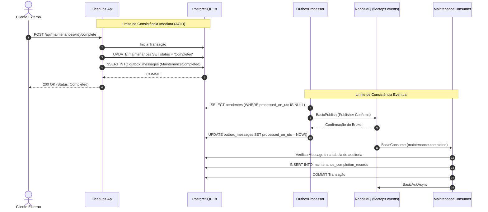

---

## 32. Decisões Arquiteturais Formalizadas (Architecture Decision Records — ADRs)

Decisões fundamentais de arquitetura, concorrência, mensageria, resiliência e segurança foram formalizadas seguindo o padrão ADR, com análise sistemática de contexto, alternativas descartadas, trade-offs e impactos operacionais:

| ADR | Título | Status | Foco e Garantia Arquitetural |
|---|---|---|---|
| [ADR-001](docs/adr/ADR-001-transactional-outbox.md) | Transactional Outbox Pattern for Reliable Event Publishing | Accepted | Eliminação de dual-write hazard com atomicidade ACID no PostgreSQL |
| [ADR-002](docs/adr/ADR-002-postgresql-concurrency-control.md) | PostgreSQL Concurrency Control via SKIP LOCKED and xmin | Accepted | Coordenação de workers concorrentes sem espera de locks e controle de concorrência otimista |
| [ADR-003](docs/adr/ADR-003-rabbitmq-client-over-masstransit.md) | Direct RabbitMQ.Client Driver Over Heavy Messaging Abstractions | Accepted | Controle de baixo nível sobre Publisher Confirms, ACK ordering e topologia nativa |
| [ADR-004](docs/adr/ADR-004-postgresql-over-redis.md) | PostgreSQL as Sole Persistence and Coordination Engine | Accepted | Prevenção de dual-source hazard e aproveitamento de integridade referencial ACID |
| [ADR-005](docs/adr/ADR-005-w3c-trace-context.md) | End-to-End W3C Trace Context Propagation Across Async Boundaries | Accepted | Rastreabilidade distribuída contínua HTTP &rarr; Outbox &rarr; RabbitMQ &rarr; Consumidor |
| [ADR-006](docs/adr/ADR-006-at-least-once-delivery.md) | Bounded At-Least-Once Delivery Semantics | Accepted | Semântica explícita de entrega com limite finito de retries, DLQ e desduplicação |
| [ADR-007](docs/adr/ADR-007-consumer-idempotency.md) | Consumer Idempotency and Single Business Effect Boundary | Accepted | Deduplicação por constraint de PK na mesma transação de negócio |
| [ADR-008](docs/adr/ADR-008-jwt-over-external-idp.md) | Self-Contained JWT Bearer Authentication for Autonomous Service Boundaries | Accepted | Fail-fast em startup sem segredo fallback e isolamento de emissor em produção |
| [ADR-009](docs/adr/ADR-009-api-rate-limiting-strategy.md) | Application-Level Rate Limiting Strategy and Gateway Offloading | Accepted | Delimitação estrita entre rate limiting local em memória e controle distribuído no gateway |

---

## 33. Roadmap de Evoluções Futuras

Itens previstos para iterações futuras no ciclo do produto:
- [x] **Autenticação & Autorização:** Implementação de JWT Bearer tokens e RBAC nativo com suporte a múltiplos papéis (`Admin`, `FleetManager`, `Dispatcher`, `Driver`).
- [x] **OpenTelemetry & Rastreamento Distribuído:** Exportação OTLP de spans de ponta a ponta correlacionados via W3C `traceparent` (HTTP &rarr; Outbox &rarr; RabbitMQ &rarr; Consumidor) e visualização integrada no Jaeger.
- [x] **Concorrência de Outbox Multi-Réplica:** Bloqueio defensivo de linha com `FOR UPDATE SKIP LOCKED` para alta escalabilidade horizontal sem lock contention.
- [x] **Pipeline CI/CD:** Automação de compilação, verificação de formatação de código e suíte de testes com PostgreSQL e RabbitMQ via GitHub Actions.
- [x] **Formalização Arquitetural e Testes de Resiliência:** 9 Architecture Decision Records (ADRs) formais e suite de testes de injeção de falhas com infraestrutura real.
- [ ] **Integração Externa OIDC:** Provedor federado de identidade com Keycloak ou Auth0.
- [ ] **Métricas Prometheus & Dashboards Grafana:** Métricas customizadas de latência de fila, taxas de retry e contadores de mensagens processadas.
- [ ] **Manifestos Kubernetes:** Helm charts para implantação com StatefulSets para persistência e Horizontal Pod Autoscalers (HPA).

---

## 34. Autor

**Autor:** Yuri Vieira  
**GitHub:** [https://github.com/DevYuriVieira](https://github.com/DevYuriVieira)

---

<a name="-english"></a>
# 🇺🇸 English

## Quick Engineering Summary

| Area | FleetOps Implementation |
|---|---|
| **Architecture** | Clean Architecture + Domain-Driven Design (DDD) with strict layer boundaries |
| **Runtime & Framework** | .NET 10 (C# 14) / ASP.NET Core 10.0.11 |
| **Data Persistence** | PostgreSQL 18 (PostgreSQL 18 Alpine in Docker) |
| **ORM & Driver** | Entity Framework Core 10.0.11 + Npgsql.EntityFrameworkCore.PostgreSQL 10.0.3 |
| **Asynchronous Messaging** | RabbitMQ 3.x with RabbitMQ.Client 7.2.2 (Async API) |
| **Event Reliability** | Transactional Outbox Pattern integrated into `DbContext.SaveChangesAsync` |
| **Outbox Concurrency** | `FOR UPDATE SKIP LOCKED` (Parallel workers select disjoint batches without waiting on locked rows) |
| **Distributed Tracing** | OpenTelemetry .NET + Jaeger (End-to-end W3C `traceparent` context propagation: HTTP &rarr; Outbox &rarr; RabbitMQ &rarr; Consumer) |
| **Authentication & RBAC** | JWT Bearer Tokens (HMAC-SHA256) + Role-Based Access Control (`Admin`, `FleetManager`, `Dispatcher`, `Driver`) |
| **Delivery Semantics** | Bounded At-least-once delivery (with finite retries and Dead-Letter Queue) |
| **Consumer Idempotency** | Single business effect within audited transaction boundary (`MessageId` PK) |
| **Resilience & Fault Tolerance** | Dead-Letter Exchange (DLX), TTL-based Retry Queues (10s, 30s, 90s), and DLQ |
| **Message Confirmations** | Publisher Confirms enabled on Outbox Publisher and Consumer (formal broker acknowledgement) |
| **Concurrency Control** | PostgreSQL Unique Constraints + Optimistic Concurrency via `xmin` (`xid` system column) |
| **Error Handling** | RFC 9457 `ProblemDetails` sanitized with zero credential, SQL, or stack trace leaks |
| **Runtime Defense** | In-Process Per-Instance Rate Limiting (Fixed Window: 100 req/60s, QueueLimit 0) with RFC 9457 (HTTP 429) & `Retry-After` |
| **Metrics & Observability** | System.Diagnostics.Metrics (`fleetops.http.*`, `fleetops.outbox.*`, `fleetops.consumer.*`) with bounded cardinality |
| **Automated Testing** | 289 automated tests (166 unit tests + 123 integration and resilience tests) |
| **Containerization** | Multi-stage Dockerfile running as non-root (`$APP_UID`) + Docker Compose (API, Postgres, RabbitMQ, Jaeger) |
| **API Contract & Health** | OpenAPI 3.1 (`/openapi/v1.json`), Liveness (`/health/live`), Readiness (`/health/ready`), Dependencies (`/health/dependencies`) |

---

## 1. Overview

**FleetOps API** is a high-reliability fleet management and logistics backend engine engineered to operate in production environments demanding strict transactional consistency and distributed fault tolerance.

Rather than treating the system as a standard CRUD application, FleetOps was deliberately designed to resolve core distributed systems challenges in logistics:
- **Integrated Fleet Asset Operations:** Managing vehicles, drivers, shipments, routes, and maintenance service orders within well-defined transactional boundaries.
- **Dual-Write Hazard Prevention:** Eradicating the risk of state drift between primary relational persistence and event publishing to the message broker.
- **Idempotent Asynchronous Processing:** Guaranteeing that redelivered messages resulting from transient network partitions or process restarts do not corrupt audit or state records.
- **Defensive Concurrency:** Shielding against race conditions at both the application orchestration level and the physical database level using PostgreSQL partial unique indexes and row versioning (`xmin`).

---

## 2. Core Capabilities

The domain model is partitioned into 5 independent Bounded Contexts represented as Aggregate Roots:

### Vehicles (`Vehicle`)
- Registration enforcing format validation for license plates (`LicensePlate`), vehicle type, year, manufacturer, and payload capacity in kilograms.
- Operational activation and deactivation, automatically revoking current driver assignments upon deactivation.
- Single source of truth for driver assignment: `Vehicle` holds the foreign key `CurrentDriverId`, emitting explicit unassignment and assignment domain events upon reassignments.
- Monotonically non-decreasing odometer updates (`Mileage`).
- Operational transitions to maintenance (`SendToMaintenance`) and return (`ReturnFromMaintenance`).

### Drivers (`Driver`)
- Operator registration with physical uniqueness enforcement on Driver License Numbers (`LicenseNumber`).
- Contact validation for corporate email and telephone formats.
- Lifecycle states: `Active`, `Inactive`, and `Suspended` (with mandatory recorded reason).
- Complete aggregate decoupling: `Driver` holds no reference to `Vehicle`.

### Deliveries (`Delivery`)
- Shipment creation with unique tracking codes (`TrackingCode`), origin/destination addresses (`Address`), priority classification, and weight in kilograms.
- Simultaneous assignment to an active vehicle and driver with capacity pre-checks.
- Lifecycle states: `Pending` &rarr; `Assigned` &rarr; `InTransit` &rarr; `Delivered` or `Cancelled` (with mandatory reason).

### Routes (`Route`)
- Route planning with origin/destination addresses and chronological consistency validation (`PlannedDeparture` prior to `EstimatedArrival`).
- Operator assignment (vehicle and driver).
- Association and disassociation of eligible shipments (`delivery_ids uuid[]`).
- Route dispatch (`Start`) enforcing an assigned vehicle, driver, and at least one linked delivery.
- Route completion with actual arrival timestamps and audited cancellation.

### Maintenance (`Maintenance`)
- Service order scheduling (`Preventive`, `Corrective`) with target service dates.
- Service commencement with start timestamps.
- Service completion recording monetary repair expenses (`Money` with decimal precision and currency) and optional vehicle reactivation.
- Audited cancellation with recorded reasons.

---

## 3. System Architecture

The architecture ensures that local domain state mutation and outbox event persistence are committed atomically within the same PostgreSQL ACID transaction. RabbitMQ operates strictly as an asynchronous downstream component, **never participating in the original database transaction**.

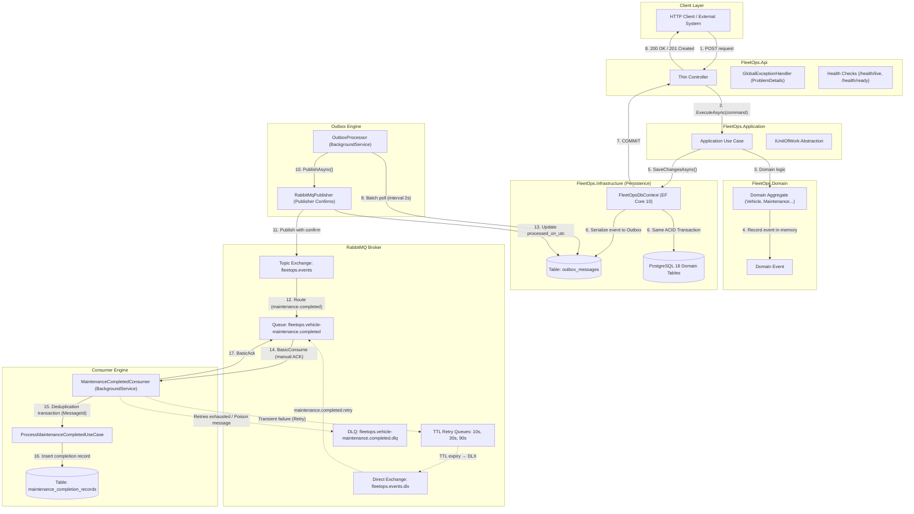

---

## 4. Clean Architecture

The solution enforces strict inwards-pointing dependencies. The business core is isolated from third-party libraries, web frameworks, and database drivers.

```
       ┌──────────────────────────────┐
       │         FleetOps.Api         │
       └───────┬──────────────┬───────┘
               │              │
               │       ┌──────▼───────────────────────┐
               │       │   FleetOps.Infrastructure    │
               │       └──────────────┬───────────────┘
               │                      │
       ┌───────▼──────────────────────▼┐
       │     FleetOps.Application     │
       └──────────────┬───────────────┘
                      │
       ┌──────────────▼───────────────┐
       │       FleetOps.Domain        │  ◄── ZERO external dependencies
       └──────────────────────────────┘
```

### `FleetOps.Domain`
- Contains Entities, Aggregate Roots (`AggregateRoot`), Value Objects, Domain Events (`IDomainEvent`), custom business exceptions, and domain enumerations.
- **Zero external dependencies**: relies exclusively on .NET base class libraries (`System`).
- Has no knowledge of HTTP, ORMs, serialization, or messaging brokers.

### `FleetOps.Application`
- Contains 28 command use cases represented by typed pairs (`[Action][Entity]Command` and `[Action][Entity]UseCase`).
- Defines repository interfaces (`IVehicleRepository`, `IDriverRepository`, `IMaintenanceRepository`, `IDeliveryRepository`, `IRouteRepository`, `IMaintenanceCompletionRecordRepository`) and the `IUnitOfWork` boundary.
- Orchestrates multi-aggregate workflows without leaking infrastructure concerns.
- Holds no reference to `FleetOps.Infrastructure`, `FleetOps.Api`, Entity Framework Core, or RabbitMQ.

### `FleetOps.Infrastructure`
- Implements persistence using Entity Framework Core 10 and PostgreSQL (`Npgsql`).
- Encapsulates transactional outbox persistence within `FleetOpsDbContext.SaveChangesAsync`.
- Hosts messaging abstractions (`RabbitMqConnection`, `RabbitMqPublisher`), background hosted services (`OutboxProcessor`, `MaintenanceCompletedConsumer`), and error mapping (`DatabaseExceptionMapper`).

### `FleetOps.Api`
- ASP.NET Core 10 presentation boundary.
- Thin controllers: bind request contracts, accept and propagate `CancellationToken`, and delegate execution to application use cases.
- Enforces an architectural rule verified by automated tests: controllers never access `DbContext`, `IUnitOfWork`, or repositories directly.
- Implements RFC 9457 `ProblemDetails` exception handling.

---

## 5. Domain Model


> [!IMPORTANT]
> **Vehicle & Driver Boundary Contract:**
> `Vehicle` is the sole owner of driver assignments (`Vehicle.CurrentDriverId`). `Driver` stores no back-reference to `Vehicle`, eliminating dual-source-of-truth anomalies. Reassigning a vehicle with an existing driver emits `DriverUnassignedFromVehicleDomainEvent` for the old driver before emitting `DriverAssignedToVehicleDomainEvent` for the newly appointed driver.

---

## 6. Business Rules & Consistency

FleetOps utilizes a dual-tier protection strategy:

```
Incoming Client Request
       ↓
[ Application / Domain Layer ]  ── Logical pre-checks and aggregate state invariants
       ↓
[ PostgreSQL Database Engine ]  ── Definitive physical barrier against race conditions
```

### Core Domain Invariants
1. **Single Driver Assignment:** A vehicle may have at most one active driver assigned at any time. Inactive or under-maintenance vehicles cannot receive driver assignments.
2. **Monotonic Mileage:** Mileage updates via `Vehicle.UpdateMileage` cannot decrease the odometer reading.
3. **Active Maintenance Mutual Exclusion:** A vehicle cannot have more than one concurrent active maintenance record (`Scheduled` or `InProgress`).
4. **Maintenance Clearance Before Reactivation:** `ReturnVehicleFromMaintenance` prevents reactivating a vehicle if active maintenance records remain in the repository.
5. **Shipment Route Eligibility:** Deliveries can only be linked to a route in `Planned` status if they are currently `Pending` or `Assigned`.
6. **Payload vs. Capacity:** Shipment assignments verify that the cargo weight does not exceed the vehicle's rated capacity (`Delivery.WeightKg <= Vehicle.CapacityKg`).
7. **Chronological Validity:** Estimated route arrival must follow planned departure; actual completion cannot precede actual departure.

---

## 7. PostgreSQL & Persistence

Database infrastructure uses PostgreSQL 18 and EF Core 10 configured with explicit mappings:

### Physical Constraints & Indexes

```sql
-- Guarantees at most ONE active maintenance (Scheduled or InProgress) per vehicle
CREATE UNIQUE INDEX ix_maintenances_vehicle_id 
ON maintenances (vehicle_id) 
WHERE status IN ('Scheduled', 'InProgress');

-- Unique license plate
CREATE UNIQUE INDEX uq_vehicles_license_plate ON vehicles (license_plate);

-- Unique driver license number
CREATE UNIQUE INDEX uq_drivers_license_number ON drivers (license_number);

-- Unique delivery tracking code
CREATE UNIQUE INDEX uq_deliveries_tracking_code ON deliveries (tracking_code);

-- Optimized partial index for pending Outbox messages
CREATE INDEX ix_outbox_messages_unprocessed 
ON outbox_messages (occurred_on_utc) 
WHERE processed_on_utc IS NULL;
```

### Schema Characteristics
- **Referential Integrity:** Foreign keys are configured with `DeleteBehavior.Restrict`, preventing accidental cascading deletion of auditable operational entities.
- **Monetary Precision:** Repair expenses are stored using separate columns: `cost_amount numeric(12,2)` and `cost_currency character varying(3)`.
- **Native UUID Arrays:** Route-delivery mappings are stored in PostgreSQL's native `uuid[]` column type configured with EF Core `ValueComparer`.
- **Timezone-Aware Timestamps:** All dates use `timestamp with time zone` (`DateTimeOffset`).
- **Enum Persistence:** Domain enums are stored as strings (`varchar`), maintaining audit readability regardless of underlying enum integer values.

---

## 8. Concurrency Control

FleetOps guards against race conditions and concurrent conflicting mutations through two complementary mechanisms:

### 1. Partial Unique Indexes (Structural Prevention)
If two concurrent HTTP requests attempt to schedule maintenance for the same vehicle simultaneously, both might pass the in-memory application check. However, during `INSERT`, PostgreSQL evaluates `ix_maintenances_vehicle_id`. Exactly one transaction commits; the conflicting transaction fails with error code `23505 (unique_violation)`.

### 2. Optimistic Concurrency via PostgreSQL `xmin`
All core entities (`Vehicle`, `Driver`, `Delivery`, `Route`, `Maintenance`) utilize PostgreSQL's system column `xmin` as a concurrency token (`IsRowVersion()`):

```csharp
builder.Property<uint>("Version").IsRowVersion();
```

In the database schema, this maps to:
```sql
xmin table.Column<uint>(type: "xid", rowVersion: true, nullable: false)
```

**Conflict Resolution Flow:**
1. Transaction `A` and Transaction `B` load the same vehicle entity at version `X`.
2. Transaction `A` updates mileage and commits. PostgreSQL updates the row's `xmin` to `X+1`.
3. Transaction `B` attempts to update driver assignment: `UPDATE vehicles ... WHERE id = @id AND xmin = @originalXmin`.
4. Zero rows are affected. EF Core throws `DbUpdateConcurrencyException`.
5. `DatabaseExceptionMapper` translates the error into a `ConflictException` (HTTP 409), preventing lost updates.

---

## 9. Transactional Outbox

The Transactional Outbox pattern eliminates the dual-write hazard in distributed event-driven systems:

```
❌ FLAWED APPROACH (DUAL-WRITE HAZARD):
1. DbContext.SaveChangesAsync()  ──> Database committed
2. RabbitMq.Publish()            ──> Network partition or crash!
Result: Database state persisted, but domain event lost forever.
```

```
✅ ATOMIC TRANSACTIONAL OUTBOX:
1. AggregateRoot records domain events in-memory.
2. DbContext.SaveChangesAsync() detects domain events via ChangeTracker.
3. Serializes each event as an OutboxMessage row.
4. Commits both aggregate state AND outbox messages within the SAME PostgreSQL ACID transaction.
5. In case of database failure, all mutations roll back and in-memory events are retained.
6. The background OutboxProcessor polls pending records and safely publishes to RabbitMQ.
```

### Multi-Replica Concurrency via `FOR UPDATE SKIP LOCKED`

In distributed cloud deployments running multiple API pods/replicas (Kubernetes HPA or clustered containers), multiple `OutboxProcessor` instances poll the `outbox_messages` table simultaneously. Without row-level locking controls, concurrent replicas would select identical pending batches, causing:
1. **Duplicate event dispatches** to RabbitMQ.
2. Row-level update lock contention and database deadlocks.

FleetOps prevents this by implementing PostgreSQL's pessimistic row-level locking via **`FOR UPDATE SKIP LOCKED`**, encapsulated within an ACID transaction managed by EF Core's `ExecutionStrategy`:

```sql
SELECT * FROM outbox_messages
WHERE processed_on_utc IS NULL AND attempts < @maxAttempts
ORDER BY occurred_on_utc
LIMIT @batchSize
FOR UPDATE SKIP LOCKED;
```

```csharp
var strategy = _context.Database.CreateExecutionStrategy();

return await strategy.ExecuteAsync(async () =>
{
    await using var transaction = await _context.Database.BeginTransactionAsync(cancellationToken);

    var messages = await _context.OutboxMessages
        .FromSqlRaw(
            """
            SELECT * FROM outbox_messages
            WHERE processed_on_utc IS NULL AND attempts < {0}
            ORDER BY occurred_on_utc
            LIMIT {1}
            FOR UPDATE SKIP LOCKED
            """,
            _options.MaxAttempts,
            _options.BatchSize)
        .ToListAsync(cancellationToken);

    // Process, dispatch, and publish to RabbitMQ with trace context...
    await _context.SaveChangesAsync(cancellationToken);
    await transaction.CommitAsync(cancellationToken);

    return processedCount;
});
```

**Key Architectural Guarantees:**
1. **Dynamic Load Partitioning:** If Replica 1 locks rows 1–20, Replica 2 executing concurrently **immediately skips** rows 1–20 without blocking or waiting, fetching rows 21–40.
2. **Contention-Free Polling Selection:** No replica blocks on another replica's locked rows under the tested concurrent workload (`lock_wait = 0ms`), preventing polling contention.
3. **Crash Fault Isolation:** If a replica crashes mid-execution, PostgreSQL automatically releases the row locks on transaction abort, allowing surviving replicas to pick up the remaining messages on the next polling cycle.

---

## 10. RabbitMQ Messaging

The messaging topology provides resilient message routing:

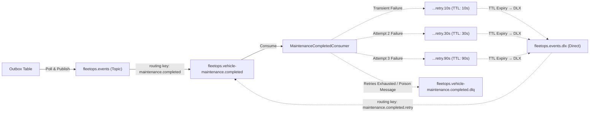

### Topology Configuration
- **Main Exchange:** `fleetops.events` (Topic exchange, durable).
- **Primary Queue:** `fleetops.vehicle-maintenance.completed` (durable, with `x-dead-letter-exchange: fleetops.events.dlx`).
- **Dead-Letter Exchange (DLX):** `fleetops.events.dlx` (Direct exchange, durable).
- **Dead-Letter Queue (DLQ):** `fleetops.vehicle-maintenance.completed.dlq` (durable).
- **Native TTL Retry Queues:**
  - `fleetops.vehicle-maintenance.completed.retry.10s` (TTL: 10,000 ms)
  - `fleetops.vehicle-maintenance.completed.retry.30s` (TTL: 30,000 ms)
  - `fleetops.vehicle-maintenance.completed.retry.90s` (TTL: 90,000 ms)

---

## 11. Business Event: `MaintenanceCompleted`

When vehicle maintenance concludes, a business event propagates across the messaging pipeline:

1. **Trigger:** Invocating `Maintenance.Complete(completedAt, cost)`.
2. **Emission:** Aggregate records `MaintenanceCompletedDomainEvent(Id, VehicleId, Cost, CompletedAt, OccurredOn)`.
3. **Outbox Persistence:** Stored in `outbox_messages` with type `MaintenanceCompleted`.
4. **Publishing:** `OutboxProcessor` publishes to `fleetops.events` using routing key `maintenance.completed` with Publisher Confirms.
5. **Consumption:** `MaintenanceCompletedConsumer` processes the payload.
6. **Business Consequence:** Executes `ProcessMaintenanceCompletedUseCase`, persisting an audit record in `maintenance_completion_records`:
   - `message_id`: Original message ID.
   - `maintenance_id`: Completed maintenance order ID.
   - `vehicle_id`: Associated vehicle ID.
   - `completed_on_utc`: Timestamp recorded by technician.
   - `processed_on_utc`: Timestamp recorded by consumer.

---

## 12. Delivery Semantics & Reliability

FleetOps guarantees **At-Least-Once Delivery**.

Distributed systems communicating over standard networks cannot promise "exactly-once delivery" without severe performance degradation. Network partitions or node crashes can occur immediately after database commit and before sending the broker ACK:

```
[ Message consumed ]
       ↓
[ Database transaction committed ]
       ↓
   CRASH BEFORE BROKER ACK!
       ↓
[ RabbitMQ detects unacknowledged channel disconnect and redelivers ]
```

To guarantee that duplicate deliveries do not result in duplicate state mutations, the consumer is fully idempotent.

---

## 13. Idempotent Consumer

The consumer enforces idempotency using `MessageId` deduplication:

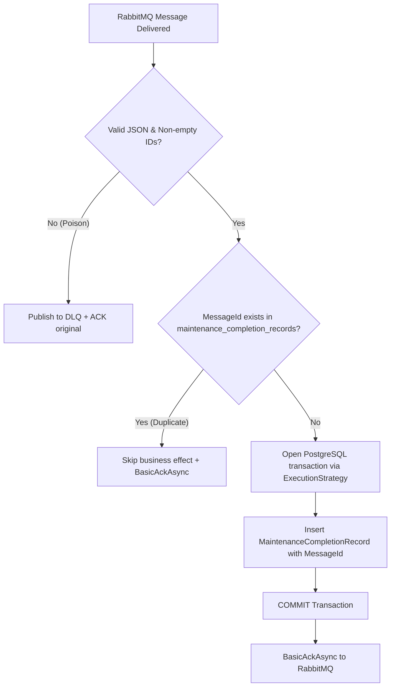

---

## 14. Retry & Dead Letter Queue (DLQ)

FleetOps avoids the common anti-pattern of issuing unbounded `BasicNack(requeue: true)`, which causes CPU saturation and message blocking:

1. **Transient Failure Interception:** If a transient database timeout occurs during consumption, the error is caught.
2. **Retry Header Increment:** The consumer updates the `x-retry-count` header.
3. **Staged TTL Routing:**
   - Attempt 1 &rarr; `.retry.10s` queue (10s delay).
   - Attempt 2 &rarr; `.retry.30s` queue (30s delay).
   - Attempt 3 &rarr; `.retry.90s` queue (90s delay).
4. **Automatic Re-routing:** Upon queue TTL expiration, messages are dead-lettered back to `fleetops.events.dlx` and delivered to the main queue.
5. **Exhaustion & Poison Messages:** After 3 failed attempts or when handling malformed payloads, messages route directly to `fleetops.vehicle-maintenance.completed.dlq` with diagnostic headers `x-dlq-reason` and `x-exception-message`.

---

## 15. Publisher Confirms

To guarantee zero message loss during publishing, Publisher Confirms are active across all publication channels:

```csharp
var channelOptions = new CreateChannelOptions(
    publisherConfirmationsEnabled: true,
    publisherConfirmationTrackingEnabled: true);
```

### Confirmation Ordering Contract
When routing a failing message to a retry queue or DLQ, the consumer **awaits positive broker confirmation of the new message before acknowledging (ACK) the original message**. If the broker fails to accept the retry message, the original ACK is withheld.

---

## 16. Failure Scenarios

| Failure Scenario | Expected System Behavior | Architectural Guarantee |
|---|---|---|
| **PostgreSQL down on API request** | Fails safely; `/health/ready` returns HTTP 503; zero connection string leaks. | Fail-fast, no data corruption |
| **RabbitMQ down on domain mutation** | State and Outbox message commit normally within PostgreSQL. | Core API uninterrupted |
| **Outbox publisher failure** | `OutboxProcessor` logs error, increments attempt counter, and retries on next poll. | At-least-once outbox delivery |
| **Database down during consumption** | Message routed through 10s &rarr; 30s &rarr; 90s retry schedule. | Resilience to transient outages |
| **Duplicate message delivery** | Consumer detects existing `MessageId` and ACKs without re-executing logic. | Idempotent processing |
| **Malformed JSON (Poison Message)** | Immediately routed to DLQ with reason header; primary queue unblocked. | Poison message isolation |
| **Crash after consumer commit before ACK** | Redelivered message is skipped idempotently via `MessageId` and ACKed. | Post-crash consistency |
| **Concurrent vehicle updates** | PostgreSQL detects `xmin` mismatch; EF Core throws concurrency exception; API returns HTTP 409. | Lost-update prevention |
| **Duplicate license plate or driver license** | Unique constraint (`uq_...`) blocks mutation; mapped to HTTP 409 ProblemDetails. | Strict relational integrity |

---

## 17. REST API Endpoints

### Authentication (`/api/auth`) — `[AllowAnonymous]`
| Method | Route | Purpose | Success |
|:---:|:---|:---|:---:|
| `POST` | `/api/auth/token` | Issue signed JWT Bearer token for testing and RBAC validation | `200 OK` |

### Vehicles (`/api/vehicles`) — Roles: `Admin`, `FleetManager`
| Method | Route | Purpose | Success |
|:---:|:---|:---|:---:|
| `POST` | `/api/vehicles` | Register vehicle asset | `201 Created` |
| `POST` | `/api/vehicles/{id}/activate` | Activate inactive vehicle | `200 OK` |
| `POST` | `/api/vehicles/{id}/deactivate` | Deactivate vehicle (unassigns driver) | `200 OK` |
| `POST` | `/api/vehicles/{id}/assign-driver` | Assign driver to vehicle | `200 OK` |
| `POST` | `/api/vehicles/{id}/unassign-driver` | Remove driver from vehicle | `200 OK` |
| `POST` | `/api/vehicles/{id}/mileage` | Update odometer reading (monotonically non-decreasing) | `200 OK` |
| `POST` | `/api/vehicles/{id}/send-to-maintenance` | Transition vehicle to maintenance | `200 OK` |
| `POST` | `/api/vehicles/{id}/return-from-maintenance` | Return vehicle to active status | `200 OK` |

### Drivers (`/api/drivers`) — Roles: `Admin`, `FleetManager`
| Method | Route | Purpose | Success |
|:---:|:---|:---|:---:|
| `POST` | `/api/drivers` | Register driver with unique license | `201 Created` |
| `POST` | `/api/drivers/{id}/activate` | Activate driver | `200 OK` |
| `POST` | `/api/drivers/{id}/deactivate` | Deactivate driver | `200 OK` |
| `POST` | `/api/drivers/{id}/suspend` | Suspend driver with mandatory reason | `200 OK` |

### Deliveries (`/api/deliveries`) — Roles: `Admin`, `FleetManager`, `Dispatcher`
| Method | Route | Purpose | Success |
|:---:|:---|:---|:---:|
| `POST` | `/api/deliveries` | Create delivery order with tracking code | `201 Created` |
| `POST` | `/api/deliveries/{id}/assign` | Assign vehicle and driver to delivery | `200 OK` |
| `POST` | `/api/deliveries/{id}/start` | Mark delivery in transit | `200 OK` |
| `POST` | `/api/deliveries/{id}/complete` | Mark delivery delivered | `200 OK` |
| `POST` | `/api/deliveries/{id}/cancel` | Cancel delivery with reason | `200 OK` |

### Routes (`/api/routes`) — Roles: `Admin`, `FleetManager`, `Dispatcher`
| Method | Route | Purpose | Success |
|:---:|:---|:---|:---:|
| `POST` | `/api/routes` | Plan route | `201 Created` |
| `POST` | `/api/routes/{id}/assign` | Assign vehicle and driver to route | `200 OK` |
| `POST` | `/api/routes/{id}/deliveries` | Add eligible delivery to route | `200 OK` |
| `DELETE` | `/api/routes/{id}/deliveries/{deliveryId}` | Remove delivery from route | `200 OK` |
| `POST` | `/api/routes/{id}/start` | Start route transit | `200 OK` |
| `POST` | `/api/routes/{id}/complete` | Complete route | `200 OK` |
| `POST` | `/api/routes/{id}/cancel` | Cancel route with reason | `200 OK` |

### Maintenance (`/api/maintenances`) — Roles: `Admin`, `FleetManager`
| Method | Route | Purpose | Success |
|:---:|:---|:---|:---:|
| `POST` | `/api/maintenances` | Schedule vehicle maintenance | `201 Created` |
| `POST` | `/api/maintenances/{id}/start` | Start maintenance service | `200 OK` |
| `POST` | `/api/maintenances/{id}/complete` | Complete maintenance with expenses | `200 OK` |
| `POST` | `/api/maintenances/{id}/cancel` | Cancel maintenance order | `200 OK` |

### Health & Specification — `[AllowAnonymous]`
| Method | Route | Purpose | Success |
|:---:|:---|:---|:---:|
| `GET` | `/health/live` | Liveness probe (process responsive) | `200 OK` |
| `GET` | `/health/ready` | Readiness probe (verifies database connection) | `200 OK` / `503` |
| `GET` | `/openapi/v1.json` | OpenAPI 3.1 specification document | `200 OK` |

---

## 18. Error Handling & ProblemDetails (RFC 9457)

All uncaught exceptions are transformed into RFC 9457 responses by `GlobalExceptionHandler`:

| Exception Type | HTTP Status | ProblemDetails Title | Description |
|---|:---:|---|---|
| `NotFoundException` | `404 Not Found` | "Not Found" | Entity not found for specified key |
| `ConflictException` | `409 Conflict` | "Conflict" | Business rule, concurrency, or unique constraint conflict |
| `DomainException` | `409 Conflict` | "Conflict" | Aggregate lifecycle state violation |
| `DomainValidationException` | `400 Bad Request` | "Bad Request" | Domain invariant validation failure |
| `ValidationException` | `400 Bad Request` | "Bad Request" | Input validation failure |
| `ArgumentException` | `400 Bad Request` | "Bad Request" | Argument validation failure |
| `BadHttpRequestException` / `JsonException` | `400 Bad Request` | "Bad Request" | Malformed JSON request payload |
| Unhandled Exceptions | `500 Internal Server Error` | "Internal Server Error" | Sanitized generic message correlated by `traceId` |

---

## 19. Authentication & Role-Based Access Control (JWT & RBAC)

FleetOps secures all business operations via **JWT Bearer Authentication** (RFC 7519) signed with HMAC-SHA256 and granular **Role-Based Access Control (RBAC)**:

### Role Permissions Matrix

| Role | Operational Scope | Authorized Endpoints |
|---|---|---|
| `Admin` | Unrestricted infrastructure & operational management | Full access across all API endpoints |
| `FleetManager` | Fleet operations, assets, and service orders | `/api/vehicles/*`, `/api/drivers/*`, `/api/maintenances/*`, `/api/deliveries/*`, `/api/routes/*` |
| `Dispatcher` | Transit, shipment dispatch, and route planning | `/api/deliveries/*`, `/api/routes/*` |
| `Driver` | Operator view | Reserved in RBAC model for future operational query endpoints |

### Authentication & Token Issuance Flow

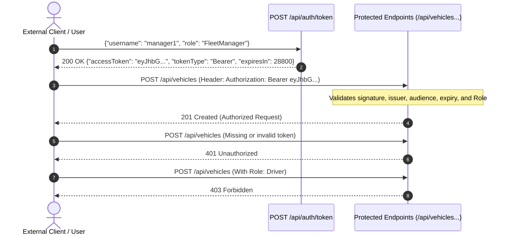

---

## 20. End-to-End Distributed Tracing (OpenTelemetry & Jaeger)

Understanding operational latency and causality across HTTP entry points, database transactional outbox polling, RabbitMQ queues, and asynchronous consumers is critical for production diagnostics.

FleetOps implements distributed tracing adhering to the **W3C Trace Context** standard (`traceparent`), propagating trace context across the entire lifecycle:

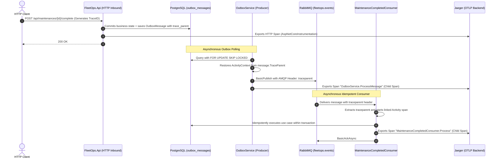

### Jaeger UI Inspection
Spans are streamed via OTLP gRPC (`port 4317`) directly to the Jaeger all-in-one container configured in `compose.yaml`:
- **Jaeger Web UI:** `http://localhost:16686`
- **Causal Waterfall Visualization:** Visually track exact latency across the HTTP call, outbox persistence, broker delivery delay, and consumer database execution.

---

## 21. Observability & Health Checks

- **Liveness Probe (`/health/live`):** Zero-I/O probe confirming process availability. Returns `200 OK`.
- **Readiness Probe (`/health/ready`):** Evaluates database connectivity using `_dbContext.Database.CanConnectAsync()`. Returns `200 OK` when healthy and `503 Service Unavailable` during database partitions.

---

## 22. Project Structure

```text
fleetops/
├── compose.yaml                      # Multi-container orchestration (API, PostgreSQL, RabbitMQ, Jaeger)
├── Dockerfile                        # Multi-stage .NET 10 build (non-root $APP_UID)
├── .dockerignore                     # Build context exclusions
├── .editorconfig                     # Code analysis and formatting standards
├── .env.example                      # Default environment configuration template
├── Directory.Build.props             # net10.0, Nullable, TreatWarningsAsErrors=true
├── Directory.Packages.props          # Central Package Management (CPM)
├── FleetOps.sln                      # Visual Studio / .NET solution
├── README.md                         # Technical documentation
├── src/
│   ├── FleetOps.Domain/              # Pure DDD core (zero external dependencies)
│   ├── FleetOps.Application/         # 28 command use cases, DTOs, repository interfaces
│   ├── FleetOps.Infrastructure/      # EF Core 10, PostgreSQL, RabbitMQ Publisher & Consumer, Outbox, Diagnostics
│   └── FleetOps.Api/                 # Thin controllers, Auth, ProblemDetails, OpenAPI 3.1, Health Probes, OTel
└── tests/
    ├── FleetOps.UnitTests/           # 166 unit tests (Domain, Application, Architecture)
    └── FleetOps.IntegrationTests/    # 114 integration tests (Postgres, RabbitMQ, Outbox Concurrency, Auth API, W3C Tracing)
```

---

## 23. Testing

FleetOps includes **289 automated tests** executing with 100% pass rate:

```text
Suite Execution Summary:
  FleetOps.UnitTests.dll:        166 Passed (0 Failed, 0 Skipped)
  FleetOps.IntegrationTests.dll: 123 Passed (0 Failed, 0 Skipped)
  Total:                         289 Passed across all suites
```

### Key Test Categories
- **Architecture Validation Tests:** Reflectively verifies that `Domain` and `Application` have no forbidden references (`AspNetCore`, `EntityFrameworkCore`, `Npgsql`, `RabbitMQ`, `StackExchange.Redis`, `MediatR`). Verifies that all controller actions and use case methods propagate `CancellationToken` and return `Task`.
- **Authentication & RBAC Tests (`AuthApiTests`):** Validates real cryptographic token handling via `JwtBearerHandler` (expired tokens, wrong signing key, untrusted issuer/audience, payload tampering), 401 Unauthorized for unauthenticated access, and 403 Forbidden for insufficient roles (e.g. `Driver` attempting to register vehicles).
- **Distributed Tracing Tests (`TracingPropagationTests`):** Automated runtime verification via `ActivityListener` of end-to-end W3C trace context propagation (`TraceId`, `SpanId`, `ParentSpanId`, `traceparent`) across `DbContext` &rarr; `OutboxService` &rarr; RabbitMQ &rarr; Consumer.
- **Outbox Concurrency Tests (`OutboxConcurrencyTests`):** Asserts that parallel instances polling via `FOR UPDATE SKIP LOCKED` partition batches with zero overlap, zero lock contention, and zero duplicate events.
- **Resilience & Failure Injection Tests (`FailureInjectionTests`):** Empirical failure boundary validation using real PostgreSQL and RabbitMQ: (1) successful RabbitMQ publication with database update failure and idempotent consumer redelivery; (2) abrupt consumer crash post-commit and pre-ACK with broker redelivery (`Redelivered == true`) preserving a single business effect; (3) database transaction rollback on physical constraint violation ensuring in-memory domain event retention and zero committed Outbox messages.
- **Rate Limiting Tests (`RateLimitingTests`):** Validates local per-instance Fixed Window rate limiting (100 req/60s, QueueLimit 0), HTTP 429 Too Many Requests response code, `Retry-After` response header, and sanitized RFC 9457 `ProblemDetails` payload.
- **Operational Metrics Tests (`MetricsVerificationTests`):** Validates runtime emission of meters and instruments via `System.Diagnostics.Metrics.MeterListener` (`fleetops.outbox.messages.published`, `fleetops.consumer.messages.processed`, latency histograms) with bounded cardinality.
- **Graceful Degradation Tests (`GracefulDegradationTests`):** Validates transactional decoupling when RabbitMQ broker is offline: `/health/ready` returns 200 OK (PostgreSQL alive), `/health/dependencies` reports `Degraded` with dependency breakdowns, command writes commit to PostgreSQL, and messages accumulate safely in Outbox.
- **Persistence Integration Tests:** Executed against PostgreSQL, validating migrations, partial unique indexes, and schema constraints.
- **Optimistic Concurrency Tests:** Validates `xmin` version conflict detection under simulated concurrent updates.
- **Mutual Exclusion Tests:** Asserts that database partial unique index `ix_maintenances_vehicle_id` rejects simultaneous maintenance orders for the same vehicle.
- **Transactional Outbox Tests:** Proves that aborted database transactions roll back outbox messages and retain in-memory domain events.
- **RabbitMQ Integration Tests:**
  - Outbox publishing with Publisher Confirms.
  - Consumer deduplication via `MessageId`.
  - Immediate dead-lettering of poison messages.
  - Native TTL retry queue schedule (10s, 30s, 90s).
  - Redelivery handling after simulated consumer crash without data duplication.
  - Clean channel teardown during graceful shutdown.
- **Docker Infrastructure Tests:** Asserts Dockerfile multi-stage builds, non-root user execution, and compose topology declarations.

---

## 24. Docker Environment


### Container Engineering Highlights
- **Multi-Stage Build:** Separates the build stage (`dotnet/sdk:10.0`) from the runtime image (`dotnet/aspnet:10.0`), minimizing container footprint.
- **Non-Root Execution:** Runs under `$APP_UID` for container security.
- **Startup Ordering:** API service declares `depends_on: service_healthy` for PostgreSQL and RabbitMQ, and `service_started` for Jaeger.
- **Native Healthchecks:**
  - PostgreSQL checked via `pg_isready -U fleetops_dev -d fleetops`.
  - RabbitMQ checked via `rabbitmq-diagnostics -q ping`.
  - API checked via `curl -f http://localhost:8080/health/ready`.

---

## 25. Technology Stack

| Component | Repository Version | Role |
|---|---|---|
| **Language** | C# 14 | Strongly-typed business logic and immutable `record` commands |
| **Runtime** | .NET 10.0 | High-performance execution runtime |
| **Web Framework** | ASP.NET Core 10.0.11 | HTTP routing, dependency injection, and middleware |
| **Authentication & RBAC** | JwtBearer 10.0.11 | HMAC-SHA256 signing and declarative role-based authorization |
| **Database** | PostgreSQL 18-alpine | Relational ACID storage, partial indexes, and MVCC `xmin` |
| **ORM & Driver** | EF Core 10.0.11 / Npgsql 10.0.3 | Object-relational mapping and change tracking |
| **Message Broker** | RabbitMQ 3-management-alpine | Event routing, topic exchange, and dead-lettering |
| **AMQP Client** | RabbitMQ.Client 7.2.2 | Asynchronous messaging with Publisher Confirms |
| **Distributed Tracing** | OpenTelemetry 1.15.3 | W3C trace instrumentation and OTLP exporter |
| **Trace Visualizer** | Jaeger all-in-one | Distributed trace UI and OTLP collection server |
| **Testing Engine** | xUnit 2.9.3 | Unit and integration test runner |
| **Web Test Host** | Microsoft.AspNetCore.Mvc.Testing 10.0.11 | In-memory API integration testing |
| **API Docs** | Microsoft.AspNetCore.OpenApi 10.0.11 | OpenAPI 3.1 specification generation |

---

## 26. Getting Started

### Prerequisites
- [.NET 10 SDK](https://dotnet.microsoft.com/download/dotnet/10.0)
- [Docker](https://docs.docker.com/get-docker/) & Docker Compose v2+
- EF Core CLI tool: `dotnet tool install --global dotnet-ef` (optional for manual migrations)

### 1. Clone Repository
```bash
git clone https://github.com/DevYuriVieira/fleetops-api.git
cd fleetops-api
```

### 2. Configure Environment
```bash
cp .env.example .env
```

### 3. Run with Docker Compose
```bash
docker compose up --build
```
- API root: `http://localhost:5000`
- OpenAPI JSON: `http://localhost:5000/openapi/v1.json`
- RabbitMQ Management UI: `http://localhost:15672` (Credentials: `guest` / `guest`)

### 4. Local Host Development
```bash
# Start PostgreSQL and RabbitMQ containers
docker compose up -d postgres rabbitmq

# Restore and build
dotnet restore
dotnet build --no-restore

# Apply database migrations
dotnet ef database update --project src/FleetOps.Infrastructure --startup-project src/FleetOps.Api

# Start API
dotnet run --project src/FleetOps.Api
```

### 5. Run Automated Tests
```bash
dotnet test
```

---

## 27. Configuration

| Variable | Default (.env) | Description |
|---|---|---|
| `ASPNETCORE_ENVIRONMENT` | `Development` | ASP.NET Core environment mode |
| `API_PORT` | `5000` | Host port for API container |
| `POSTGRES_PORT` | `5432` | Host port for PostgreSQL |
| `POSTGRES_DB` | `fleetops` | PostgreSQL database name |
| `POSTGRES_USER` | `fleetops_dev` | PostgreSQL development user |
| `POSTGRES_PASSWORD` | `fleetops_dev_secret` | PostgreSQL development password |
| `RABBITMQ_PORT` | `5672` | RabbitMQ AMQP port |
| `RABBITMQ_MGMT_PORT` | `15672` | RabbitMQ Management Web UI port |

---

## 28. Architectural Decisions

- **Why Clean Architecture & DDD?** Fleet operations require complex invariant enforcement (non-decreasing odometers, payload limits, strict state machines). Domain isolation shields business rules from external technology shifts.
- **Why Transactional Outbox?** Publishing directly to a broker during HTTP request processing introduces dual-write hazards. Outbox ensures database state and event persistence are committed atomically.
- **Why At-least-once with Idempotency?** Exactly-once message delivery across distributed networks is a physical impossibility without severe distributed locking penalties. Bounded at-least-once delivery coupled with `MessageId` deduplication achieves a single business effect within the audited transaction boundary without distributed locks.
- **Why PostgreSQL `xmin`?** Leverages PostgreSQL's native MVCC tracking without adding artificial version columns to tables.

---

## 29. Deliberate Scope: Why NOT Redis / Kafka / MassTransit / MediatR

FleetOps prioritizes **Correctness > Unnecessary Complexity**:

- **Why not Redis?** PostgreSQL's ACID guarantees and partial indexes completely handle concurrency control. Introducing Redis would introduce an unnecessary cache-invalidation boundary.
- **Why not Apache Kafka?** Kafka is built for high-throughput event streaming with partitioned commit logs. For asynchronous service tasks and queue-based retry/DLQ patterns, RabbitMQ is the appropriate solution.
- **Why not MassTransit?** While capable, a lightweight implementation on top of official `RabbitMQ.Client` allows explicit control over ACK ordering, Publisher Confirms, and DLX routing without heavy framework abstractions.
- **Why not MediatR?** Explicit typed use case classes provide immediate navigation (F12), transparent dependency injection, and eliminate reflection indirection.

---

## 30. Production Gate

The codebase was audited under an independent adversarial review verifying transactional boundaries, fault tolerance, security, and exception sanitization:

```text
==================================================
           FINAL PRODUCTION GATE REVIEW
==================================================
  CRITICAL FINDINGS: 0
  HIGH FINDINGS:     0
  MEDIUM FINDINGS:   0
  LOW FINDINGS:      0
  STATUS:            APPROVED FOR PRODUCTION
==================================================
```

Validated Production Baselines:
1. **Zero Message Loss:** Transactional Outbox + Publisher Confirms.
2. **ACK Ordering:** Publisher confirmation precedes consumer ACK.
3. **No Requeue Loops:** Replaced `nack(requeue: true)` with TTL retry queues.
4. **Data Sanitization:** Stack traces and connection credentials fully suppressed in API responses.
5. **Container Security:** Multi-stage build running under non-root user `$APP_UID`.

---

## 31. End-to-End Reliability Model


---

## 32. Architecture Decision Records (ADRs)

Formal Architecture Decision Records documenting engineering decisions, problem context, evaluated alternatives, trade-offs, and operational consequences:

| ADR | Title | Status | Architectural Scope & Focus |
|---|---|---|---|
| [ADR-001](docs/adr/ADR-001-transactional-outbox.md) | Transactional Outbox Pattern for Reliable Event Publishing | Accepted | Dual-write hazard mitigation via PostgreSQL ACID transaction boundary |
| [ADR-002](docs/adr/ADR-002-postgresql-concurrency-control.md) | PostgreSQL Concurrency Control via SKIP LOCKED and xmin | Accepted | Contention-free concurrent worker polling and optimistic row versioning |
| [ADR-003](docs/adr/ADR-003-rabbitmq-client-over-masstransit.md) | Direct RabbitMQ.Client Driver Over Heavy Messaging Abstractions | Accepted | Low-level control over Publisher Confirms, ACK ordering, and native topology |
| [ADR-004](docs/adr/ADR-004-postgresql-over-redis.md) | PostgreSQL as Sole Persistence and Coordination Engine | Accepted | Dual-source hazard prevention leveraging ACID relational guarantees |
| [ADR-005](docs/adr/ADR-005-w3c-trace-context.md) | End-to-End W3C Trace Context Propagation Across Async Boundaries | Accepted | Continuous distributed tracing HTTP &rarr; Outbox &rarr; RabbitMQ &rarr; Consumer |
| [ADR-006](docs/adr/ADR-006-at-least-once-delivery.md) | Bounded At-Least-Once Delivery Semantics | Accepted | Explicit bounded delivery semantics with finite retries, DLQ, and deduplication |
| [ADR-007](docs/adr/ADR-007-consumer-idempotency.md) | Consumer Idempotency and Single Business Effect Boundary | Accepted | Primary-key deduplication within the audited business transaction boundary |
| [ADR-008](docs/adr/ADR-008-jwt-over-external-idp.md) | Self-Contained JWT Bearer Authentication for Autonomous Service Boundaries | Accepted | Fail-fast startup validation with no insecure secret fallbacks |
| [ADR-009](docs/adr/ADR-009-api-rate-limiting-strategy.md) | Application-Level Rate Limiting Strategy and Gateway Offloading | Accepted | Strict demarcation between in-memory local limits and edge/gateway distributed control |
| [ADR-010](docs/adr/ADR-010-in-process-rate-limiting.md) | In-Process Fixed Window Rate Limiting with Boundary Demarcation | Accepted | Node-level resource defense with RFC 9457 429 and Retry-After header |
| [ADR-011](docs/adr/ADR-011-health-checks-and-dependency-readiness.md) | Health Check Probing Semantics: Live, Ready, and Degraded Dependencies | Accepted | Decoupled liveness, readiness, and degraded multi-dependency diagnostics |
| [ADR-012](docs/adr/ADR-012-operational-metrics-and-telemetry.md) | Operational Metrics and Telemetry Cardinality Discipline | Accepted | System.Diagnostics.Metrics with bounded dimensions for Outbox and Consumer |
| [ADR-013](docs/adr/ADR-013-load-testing-and-performance-baseline.md) | Empirical Performance Baseline via k6 | Accepted | Automated reproducible load, sustained, and spike profiles without fantasy benchmarks |
| [ADR-014](docs/adr/ADR-014-sli-slo-and-error-budget-framework.md) | Service Level Objectives (SLOs) and Error Budget Framework | Accepted | Mathematically grounded SLIs/SLOs covering latency, availability, and processing delay |

---

## 33. Operational Runbooks

Standard Operating Procedures (SOP) and incident remediation runbooks for on-call engineers:

| Runbook | Scenario & Primary Trigger | Detection & Alert | Mitigation Action |
|---|---|---|---|
| [PostgreSQL Outage](docs/runbooks/postgresql-unavailable.md) | PostgreSQL database offline, connection refused, or pool exhausted | Readiness `/health/ready` returns 503; error spikes | Verify storage/WAL, check connection pool, fail over to standby |
| [RabbitMQ Outage](docs/runbooks/rabbitmq-unavailable.md) | Message broker offline or connection refused | Diagnostic `/health/dependencies` reports Degraded; outbox backlog growth | System gracefully persists commands; restart broker or repair cluster; outbox drains automatically |
| [Outbox Backlog Accumulation](docs/runbooks/outbox-backlog.md) | Unprocessed outbox records exceed threshold (`> 500`) | Metric `fleetops.outbox.backlog.count`; publication failure count | Inspect broker network, adjust worker batch size or horizontal worker replicas |
| [Consumer Redeliveries & DLQ](docs/runbooks/consumer-redelivery-and-dlq.md) | Messages accumulating in Dead-Letter Queue (`fleetops.events.dlq`) | Metric `fleetops.consumer.messages.failed`; DLQ depth `> 0` | Inspect poison message payload, verify downstream schema, replay or purge |

---

## 34. Service Level Objectives (SLOs) & Error Budgets

Target SLOs established under empirical operating characteristics:

| Service / Flow | Service Level Indicator (SLI) | SLO Target (30-day Rolling) | Monthly Error Budget | Budget Burn Alert Threshold |
|---|---|---|---|---|
| **API Synchronous Writes** | Successful HTTP responses (`2xx` or `4xx` client error vs `5xx` server faults) | $\ge 99.9\%$ Availability | 0.10% (43.2 min downtime) | 2% burn in 1 hour; 5% burn in 6 hours |
| **API Synchronous Latency** | P95 response duration on `/api/*` endpoints | $\le 250\text{ ms}$ (P95) | 5% tail samples exceeding 250 ms | 10% exceeding in 15-minute window |
| **Outbox Relay Latency** | Time between `occurred_on_utc` and broker publication ACK | $\le 5.0\text{ s}$ (P95) | 5% events delayed beyond 5s | Unprocessed backlog $> 500$ messages for $> 2\text{ min}$ |
| **Consumer Processing Latency** | Time from consumer dispatch to transactional commit and ACK | $\le 100\text{ ms}$ (P95) | 5% messages delayed beyond 100 ms | Consumer failure count $> 10$ in 1 minute |

---

## 35. Infrastructure / Health Baseline (In-Memory HTTP Benchmarks)

> [!WARNING]
> **Contexto Operacional e Distinção Arquitetural:**
> O benchmark de **~808 RPS** estabelecido na Sprint P1 corresponde **exclusivamente a sondas de diagnóstico in-memory** (`/health/live`), onde o Kestrel responde sem persistência, sem transações relacionais e sem serialização de mensagens. **Não deve ser interpretado como capacidade de negócio ou taxa de comandos transacionais da FleetOps API.**

Empirical load testing executed with **k6 v0.56.0** against in-memory diagnostic probes:

```text
Host Environment:
  OS: Windows 11 Enterprise (x64) / AMD Ryzen / 16 cores / 32 GB RAM
  Build: Release (--configuration Release)
  Target: GET /health/live, GET /health/dependencies
```

| Scenario | Concurrency (VUs) | Duration | Total Requests | Throughput (RPS) | P50 Latency | P90 Latency | P95 Latency | Max Latency | Error Rate |
|---|---|---|---|---|---|---|---|---|---|
| **Baseline Load** | 5 VUs | 30s | 2,764 | **91.81 req/s** | 2.69 ms | 9.17 ms | 10.34 ms | 74.56 ms | **0.00%** (0 / 2,764) |
| **Sustained Load** | 15 VUs | 30s | 17,123 | **568.74 req/s** | 565 µs | 1.77 ms | 2.41 ms | 83.80 ms | **0.00%** (0 / 17,123) |
| **Traffic Spike** | Ramp to 40 VUs | 20s | 16,178 | **808.09 req/s** | 592 µs | 1.59 ms | 2.10 ms | 9.49 ms | **0.00%** (0 / 16,178) |

---

## 36. Domain Capacity & Saturation Validation (Database Transactional Benchmarks)

> [!IMPORTANT]
> **Metodologia Evidence-First (Sprint P2):**
> Para medir a capacidade real de domínio sem extrapolações infundadas, a carga foi direcionada ao endpoint de escrita transacional autenticado (`POST /api/vehicles`), exercitando o pipeline completo: validação criptográfica de token JWT, instanciação de agregados e invariantes de domínio, transações ACID com MVCC `xmin` no PostgreSQL 18 e persistência no Transactional Outbox.
> 
> *Nota de Honestidade Operacional:* Todos os benchmarks foram executados em ambiente de desenvolvimento local (single-node). Os números refletem o comportamento observado sob as condições descritas e **não equivalem a capacidade máxima em cluster produtivo distribuído**. O ponto de saturação é dependente do hardware e da infraestrutura de teste.

### Tabela de Capacidade Empírica Observada (Sprint P2)

| Workload | Concorrência | Requisições | Throughput Observado | P50 | P90 | P95 | Max | Erros HTTP | Persistência DB | Veredito |
|---|---|---|---|---|---|---|---|---|---|---|
| **RateLimit Burst** | 10 VUs (10s) | 7,716 reqs | **759.38 req/s** | 1.08 ms | 2.46 ms | 3.32 ms | 515.45 ms | 98.70% (HTTP 429) | 100 veículos | **PASS (RFC 9457 / RFC 6585)** |
| **Domain Baseline** | 5 VUs (30s) | 2,596 reqs | **86.27 req/s** | 5.63 ms | 9.88 ms | 11.81 ms | 369.81 ms | **0.00%** | 2,595 veículos | **PASS (Capacidade Estável)** |
| **Domain Sustained** | 15 VUs (45s) | 12,526 reqs | **277.83 req/s** | 3.88 ms | 43.73 ms | 72.16 ms | 200.29 ms | **0.00%** | 12,525 veículos | **PASS (Vazão Sustentável)** |
| **Domain Spike** | 5 &rarr; 35 &rarr; 5 VUs | 3,072 reqs | **153.16 req/s** | 10.12 ms | 260.59 ms | 357.84 ms | 1.13 s | **0.00%** | 3,071 veículos | **PASS (Recuperação sem Falhas)** |
| **Domain Stress** | 5 &rarr; 70 VUs (50s) | 9,921 reqs | **198.31 req/s** | 75.36 ms | 348.10 ms | 392.93 ms | 801.66 ms | **0.00%** | 9,920 veículos | **PASS (Saturação Observada)** |

### Conclusões de Engenharia de Capacidade:
1. **Pico de Vazão Sustentável Observado no Workload:** Atingido em **15 VUs** com **277.83 RPS**, P50 de **3.88 ms** e P95 de **72.16 ms**. *(Nota: Representa o pico observado no perfil testado, não o teto teórico absoluto do sistema).*
2. **Knee de Degradação / Ponto de Saturação:** Observado entre **25 e 35 VUs**. Acima dessa faixa, a concorrência adicional causa contenção no pool de conexões do Npgsql (`Duração da transação relacional ↑ → Ocupação de conexões ↑ → Fila de espera no pool Npgsql ↑ → Latência percebida ↑`), elevando o P50 para **75.36 ms** e reduzindo a vazão média observada para **198.31 RPS**.
3. **Resiliência sob Spike e Falha:** Sob spike de 35 VUs, a latência atingiu temporariamente 1.13s; após a redução da concorrência, as requisições subsequentes retornaram ao regime normal de latência observado, com recuperação operacional inferior a 15 ms no cenário medido. Em testes com RabbitMQ offline, nenhuma perda de eventos foi observada (Outbox acumulou e drenou automaticamente após a recuperação).

Para detalhes exaustivos, telemetria de componentes, análise de gargalos e cálculo de Error Budget:
- [ADR-015 — Capacity Engineering and Performance Validation](docs/adr/ADR-015-capacity-engineering-and-performance-validation.md)
- [P2 Capacity & Operational Proof Report](docs/performance/P2-CAPACITY-REPORT.md)

```bash
# Execução seletiva de suites de teste de carga:
./load-tests/run-benchmarks.ps1 -Suite Health
./load-tests/run-benchmarks.ps1 -Suite Domain
./load-tests/run-benchmarks.ps1 -Suite Stress
./load-tests/run-benchmarks.ps1 -Suite RateLimit
./load-tests/run-benchmarks.ps1 -Suite All
```

---

## 37. Roadmap

Planned future enhancements:
- [x] **Authentication & Role-Based Access Control:** Native JWT Bearer token generation and RBAC authorization policies (`Admin`, `FleetManager`, `Dispatcher`, `Driver`).
- [x] **OpenTelemetry & Distributed Tracing:** End-to-end W3C `traceparent` context propagation across HTTP, Transactional Outbox, RabbitMQ, and Idempotent Consumers with Jaeger UI.
- [x] **Multi-Replica Outbox Concurrency:** `FOR UPDATE SKIP LOCKED` row-level partitioning for high-scale horizontal pod autoscaling.
- [x] **CI/CD Automation:** GitHub Actions CI workflow with clean containerized PostgreSQL and RabbitMQ execution.
- [x] **Formal Architecture & Failure Engineering:** 15 formal ADRs and real-infrastructure failure injection integration test suite (293 tests).
- [x] **Operational Metrics:** Native `System.Diagnostics.Metrics.Meter("FleetOps")` instrumentation adhering to strict cardinality discipline.
- [x] **In-Process Rate Limiting:** ASP.NET Core Fixed Window rate limiting with RFC 9457 `ProblemDetails` (HTTP 429) and `Retry-After`.
- [x] **Health Probing Semantics:** Clean separation of `/health/live`, `/health/ready`, and `/health/dependencies` with graceful degradation reporting.
- [x] **Domain Capacity Engineering:** Empirically measured domain transactional capacity (up to 278 RPS) and progressive stress saturation.
- [x] **Operational Runbooks:** SRE procedures for PostgreSQL outages, RabbitMQ broker downtime, outbox backlogs, and DLQ handling.
- [ ] **External OIDC Integration:** Federated identity integration with Keycloak or Auth0.
- [ ] **Prometheus Exporter & Grafana Dashboards:** Pre-built dashboards for outbox latency, retry rates, and consumer throughput.
- [ ] **Kubernetes Manifests:** Production Helm charts with StatefulSet storage configurations and HPA rules.

---

## 37. Author

**Author:** Yuri Vieira  
**GitHub:** [https://github.com/DevYuriVieira](https://github.com/DevYuriVieira)
